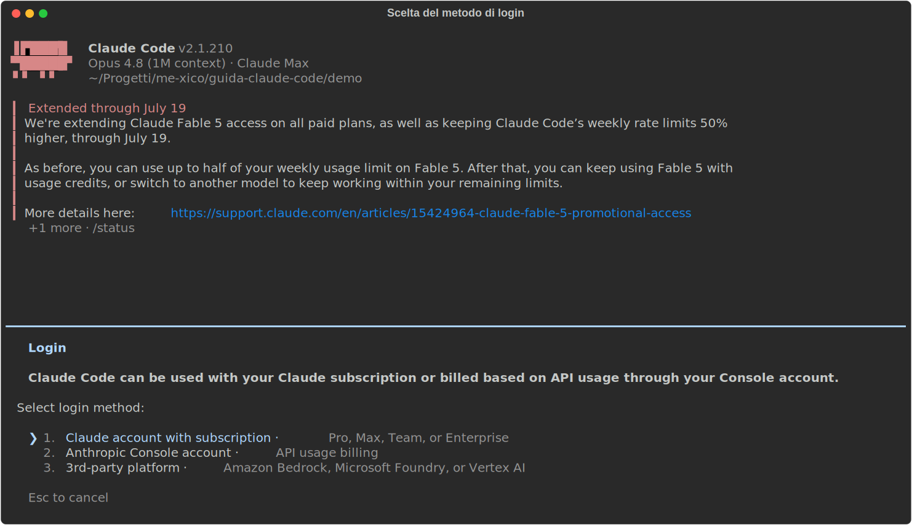
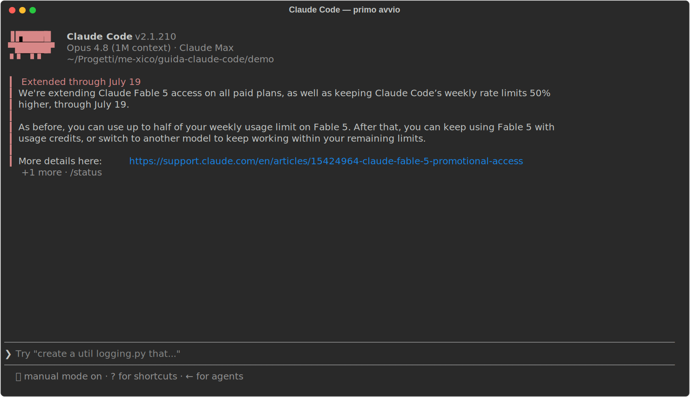

# 01 - Installation and first launch

> Verified on July 15, 2026 against the official docs, with Claude Code **2.1.210**.
> If any command doesn't match, check the [setup docs](https://code.claude.com/docs/en/setup).

In this chapter we install Claude Code, log in, and take a look at what
happens on first launch. By the end you'll have a working `claude` in your
terminal and you'll know where to look if something doesn't start.

## Installation

**What it is.** The official installer is a simple script that downloads a
native binary and puts it on your `PATH`. It's the recommended method for a
specific reason: a binary installed this way **updates itself in the
background**, like a modern browser does, so after installation you never
have to think about it again.

**How to install it.** One command, depending on your system:

```bash
# macOS / Linux / WSL
curl -fsSL https://claude.ai/install.sh | bash
```

```powershell
# Windows (PowerShell)
irm https://claude.ai/install.ps1 | iex
```

**Where it ends up.** The binary goes into `~/.local/bin/claude`. It's a
self-contained executable: **no Node.js required**, nor any other runtime.
If you've seen the npm package around (`npm install -g @anthropic-ai/claude-code`),
know that it's the legacy route: it still works, but all it does is download
the same native binary. There's no reason to prefer it.

If you'd rather have your package manager handle updates instead (no
auto-update), the classic alternatives exist: Homebrew
(`brew install --cask claude-code`), WinGet, and signed apt/dnf/apk
repositories.

**Verify.** As soon as it's done, check that the binary responds:

```console
$ claude --version
2.1.210 (Claude Code)
```

If the command isn't found, the problem is almost always that
`~/.local/bin` is not on your shell's `PATH`.

**Requirements and platform notes.** You need macOS 13+ / Windows 10 1809+ /
Ubuntu 20.04+ / Debian 10+ and 4 GB of RAM, requirements any development
machine meets. Two notes are worth calling out:

- **Native Windows**: Git for Windows is optional, but it also installs a
  bash, and that enables Claude Code's Bash tool. Without it, Claude runs
  commands through PowerShell. It works, but most examples you'll find
  around (and in this guide) assume a POSIX shell.
- **WSL**: install Claude Code *inside* the Linux distribution (that is,
  with the `curl` script from a WSL terminal), not from PowerShell. It has
  to live in the same world as the files you'll be working on.

## Login and plans

**How it works.** The first time you run `claude`, before you can type
anything, the authentication flow kicks in: Claude Code opens your browser,
you authenticate there, and the terminal receives the credentials. This is
the choice screen that greets you:



The two options correspond to two different ways of paying:

- **claude.ai subscription (Pro/Max)**: the simple route for personal use,
  OAuth via browser, no API keys to manage, fixed monthly cost.
- **Claude Console (API)**: for usage-based or business billing, you pay
  for the tokens you actually use, with no hourly limits.

| Plan | Cost | Claude Code |
|---|---|---|
| Free | 0 $ | ❌ not included |
| Pro | 20 $/month | ✅ ~200 messages / 5 hours |
| Max 5x / 20x | 100 / 200 $/month | ✅ 5x / 20x the Pro limits |
| API | per token | ✅ no hourly limits |

How to read the table: subscription plans have a message budget that resets
every 5 hours. To get started, **Pro is enough**: you only feel the limit
under heavy use. If Claude Code becomes your main tool, Max 5x is the
natural upgrade; the API makes sense when you need usage without hourly
caps, or business billing.

**Where the credentials end up.** On Linux in
`~/.claude/.credentials.json`, with `0600` permissions (readable only by
you); on macOS in the system Keychain. You never need to touch them by
hand: to switch accounts without leaving the session there's `/login`, and
`/logout` to sign out.

## First launch

Once login is done you land straight in the interactive prompt. No wizard,
no theme picker (you can change that later with `/config`): Claude Code
shows you the version, active model, and plan, and waits for your first
message.



Note the three items at the top of the screen (version, model, plan):
they're the first thing to check when something behaves unexpectedly. Two
commands to know right away:

- `/help`, the list of available commands.
- `/doctor`, the full diagnostics: it checks the installation,
  configuration, MCP servers, and update status. It also exists outside the
  session as `claude doctor`, useful precisely when Claude won't start and
  you can't use the slash command.

## VS Code extension (and the other interfaces)

For those who live in the editor there's the official extension: search for
**"Claude Code"** in the marketplace (publisher Anthropic, id
`Anthropic.claude-code`, requires VS Code 1.98+). Compared to the CLI it
adds a chat panel, side-by-side diffs with inline comments, checkpoints to
rewind your code, and permission management right from the prompt box.

One important detail to understand: the extension bundles its **own copy of
the CLI**, but **shares the configuration**: `~/.claude/settings.json`, the
CLAUDE.md files, MCP servers, skills. In practice there is a single Claude
Code "identity" on your machine: everything you configure in the terminal
(ch. 02) automatically applies in the editor too, and vice versa.

There are also a **desktop app** (macOS/Windows/Linux) and **Claude Code on
web**: same substance, different interfaces. This guide uses the CLI, which
is where all the features live.

## Updates

With the native installer the rule is: you do nothing. The binary checks
for and downloads updates on its own, in the background. If you want to
force an update manually there's `claude update`; to see how the last
attempt went, `claude doctor`.

The only choice you get to make is **which release channel** to follow.
It's configured in `settings.json` (the configuration file we'll cover in
detail in ch. 02; for personal settings it's `~/.claude/settings.json`).
The complete file, in the minimal case, is this:

```json
{ "autoUpdatesChannel": "stable" }
```

There are two possible values: `latest` (the default, you get new releases
as soon as they ship) and `stable` (about a week behind, so releases with
regressions get skipped before they reach you). If you installed with
Homebrew/WinGet/apt, there's no auto-update: you update with your package
manager, like any other package.

---

**In short**: `curl | bash`, log in with the browser, `/doctor` if
something looks off. Next chapter: where the configuration lives and how to
bend it to your project.
