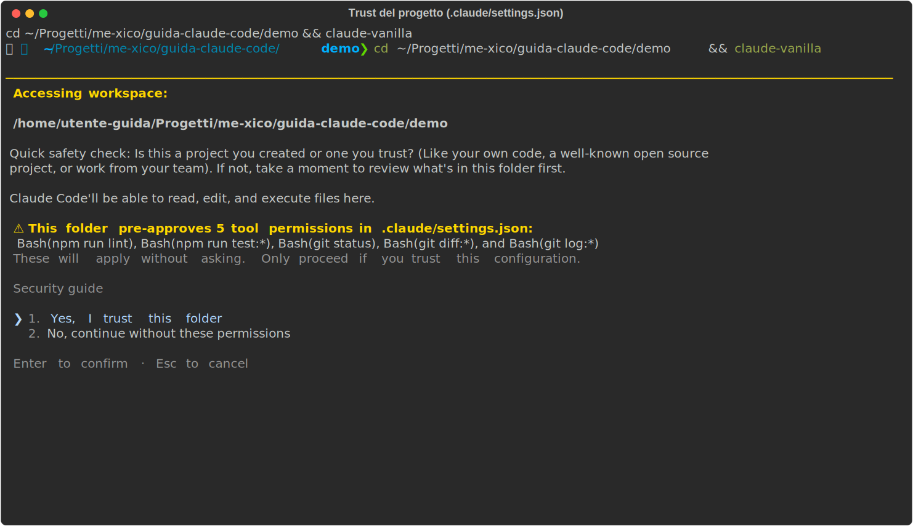
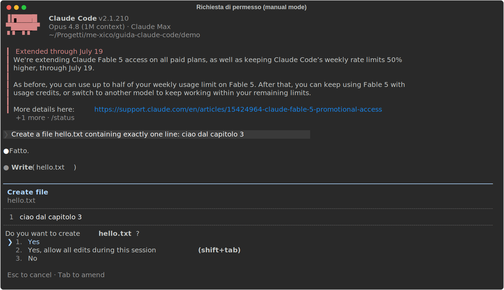
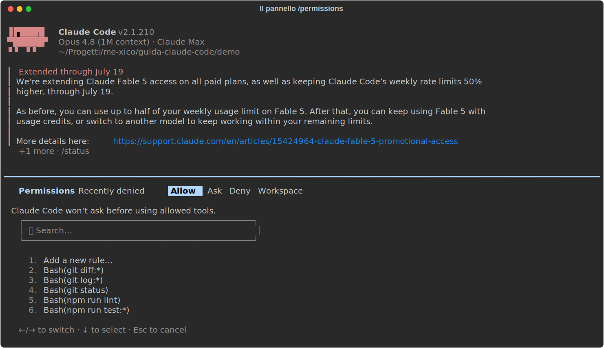
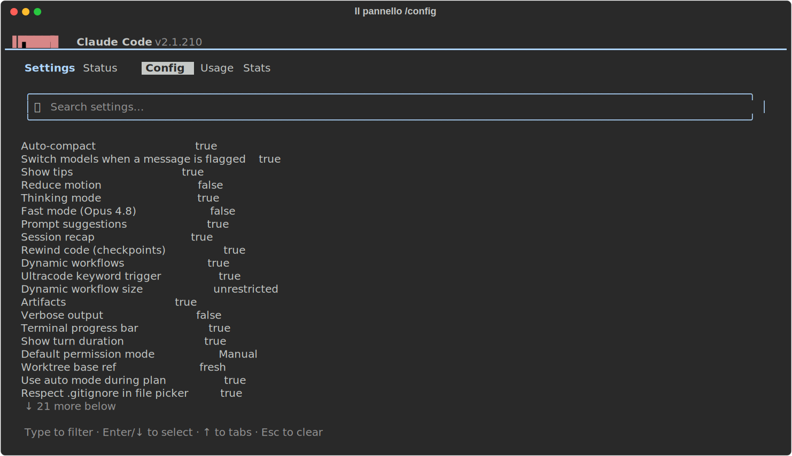

# 02 - Setup e configurazione

> Verificato il 15 luglio 2026 sulla doc ufficiale (v2.1.210).
> Esempio vivo: il progetto d'esempio `demo/` di questa guida contiene un
> progetto React/TS con `CLAUDE.md` e `.claude/settings.json` reali.

La configurazione di Claude Code ruota attorno a tre cose: **dove** stanno i
file, **cosa** ci scrivi dentro (permessi, modello, istruzioni) e **come**
Claude li combina quando parte una sessione. Questo capitolo le affronta in
quest'ordine.

## Dove vive la configurazione

**Cos'è.** Claude Code legge la configurazione da due mondi distinti:
`~/.claude/` nella tua home (personale: vale per te, su qualunque progetto)
e `.claude/` dentro il progetto (condiviso col team via git). L'analogia
utile è quella delle preferenze utente vs. la config del repo: `.editorconfig`
è del progetto e viaggia con il codice, le impostazioni del tuo editor sono
tue e restano sulla tua macchina.

**Come funziona il merge.** All'avvio della sessione i settings dei vari
livelli si sommano; quando la stessa chiave è definita a più livelli, vince
il livello più forte. La precedenza, dal più forte al più debole:

| Livello | File | In git? |
|---|---|---|
| Managed (azienda) | `/etc/claude-code/managed-settings.json` | gestito dall'IT, non scavalcabile |
| Flag CLI | `claude --permission-mode …` | no (solo sessione) |
| Locale | `.claude/settings.local.json` | **no** (gitignorato in automatico) |
| Progetto | `.claude/settings.json` | **sì** |
| Utente | `~/.claude/settings.json` | no |

Leggila dal basso: i tuoi default globali (`~/.claude/settings.json`) valgono
ovunque, il progetto li può scavalcare, tu puoi scavalcare il progetto con il
file locale, un flag CLI vale solo per quella sessione, e sopra tutto ci
sono gli eventuali vincoli aziendali.

La regola pratica per decidere dove scrivere una cosa: in
`.claude/settings.json` le convenzioni di team (permessi, hook), è
committato, quindi chi clona il repo se le ritrova; in
`.claude/settings.local.json` i tuoi override personali su quel progetto,
Claude Code lo gitignora in automatico; in `~/.claude/settings.json` i
default che vuoi su ogni progetto. I file si ricaricano **a caldo**: modifichi
e la sessione in corso vede il cambiamento, senza riavviare (le uniche
eccezioni sono `model` e `outputStyle`).

## settings.json: le chiavi che usi davvero

**Cos'è.** Il file di settings è un JSON che governa il comportamento di
Claude Code: che cosa può fare senza chiederti il permesso, quale modello
usare, quali hook eseguire. Lo crei tu a mano (o lo fa `/permissions` quando
salvi una regola dal pannello); non esiste finché qualcuno non lo scrive.

**Come si scrive.** Questo è il file **completo** del progetto demo,
`demo/.claude/settings.json`:

```json
{
  "permissions": {
    "allow": [
      "Bash(npm run lint)",
      "Bash(npm run test:*)",
      "Bash(git status)",
      "Bash(git diff:*)",
      "Bash(git log:*)"
    ],
    "deny": [
      "Read(.env)",
      "Read(.env.*)",
      "Bash(cat *.env*)"
    ]
  }
}
```

La sintassi di ogni regola è `Tool(specifier)`: il nome del tool di Claude
Code (`Bash`, `Read`, `Edit`, …) e, tra parentesi, un pattern con glob su
cosa la regola copre. Quindi `Bash(npm run test:*)` copre `npm run test` e
ogni sua variante (`npm run test:unit`, …), `Read(*.md)` copre la lettura
dei file markdown, `Edit(.github/**)` le modifiche sotto `.github/`.

Le liste sono tre, e rispondono a tre domande diverse:

- `allow`: "fallo senza chiedermelo", niente prompt di conferma.
- `deny`: "mai, in nessun caso", bloccato sempre, e **vince su tutto**
  (anche su un `allow` che lo coprirebbe).
- `ask`: "chiedimelo esplicitamente ogni volta".

**Come funziona in pratica.** Quando Claude sta per usare un tool, la
richiesta viene confrontata con le regole: se matcha un `deny` viene
bloccata, se matcha un `allow` passa senza prompt, altrimenti si applica il
permission mode corrente (sezione successiva). Il pattern più importante da
copiare subito è **il deny sui segreti**: `.env` e simili non devono essere
leggibili nemmeno per sbaglio. Nota come il deny della demo chiude entrambe
le porte: il tool `Read` (le prime due regole) e la lettura via shell con
`cat` (la terza). Bloccarne solo una lascerebbe l'altra aperta.

C'è un momento in cui questo file ti passa davanti agli occhi: la prima
volta che apri un progetto che contiene permessi pre-approvati, Claude Code
te li elenca e ti chiede se ti fidi. È una tutela sensata, quel file arriva
dal repo, cioè da altri, e questo è il trust dialog della nostra demo, con
le regole `allow` e `deny` viste sopra:



Oltre a `permissions`, le altre chiavi che incontrerai in questa guida:
`model`, `hooks` (cap. 07), `env` (variabili d'ambiente per la sessione),
`statusLine`, `outputStyle`, `autoUpdatesChannel` (cap. 01),
`enabledPlugins` (cap. 09), `permissions.defaultMode` (qui sotto).

## Permission mode

**Cos'è.** Se le regole di `settings.json` decidono il destino delle singole
azioni, il permission mode è la manopola globale: quanto Claude può fare
*senza chiedere* per tutto ciò che non è coperto da una regola. Si cambia in
tre modi: **Shift+Tab** durante la sessione (il più comodo),
`--permission-mode` all'avvio, o `permissions.defaultMode` nei settings per
renderlo il default.

| Mode | Cosa fa senza chiedere |
|---|---|
| `default` (Manual) | solo letture; chiede per edit e comandi |
| `acceptEdits` | letture + edit dei file + operazioni fs sicure |
| `plan` | solo letture: esplora e propone un piano, non tocca nulla |
| `auto` | tutto, ma ogni azione passa da un classificatore di sicurezza; richiede modelli recenti e account abilitato |
| `dontAsk` | solo ciò che è in `allow`, il resto è negato (per uso non interattivo) |
| `bypassPermissions` | tutto senza controlli: **solo in container/VM isolate** |

**Come si presenta.** In `default` (Manual), ogni scrittura ti passa davanti
prima di essere eseguita. Ecco la richiesta per la creazione di un file:
nota che il prompt mostra il **diff completo** di quello che verrebbe
scritto, decidi guardando il contenuto reale, non una descrizione, e che
tra le opzioni c'è la scorciatoia per passare direttamente ad `acceptEdits`
se ti sei stancato di confermare ogni edit:



La progressione consigliata: `default` finché non hai preso confidenza, poi
`acceptEdits` per il lavoro quotidiano, `plan` quando affronti task grossi
in cui vuoi vedere il piano prima del codice (cap. 03). Qualunque mode tu
scelga, i percorsi protetti (`.git/`, `.claude/`, i dotfile della shell) non
vengono mai auto-approvati: quelli te li chiede sempre.

Per vedere e modificare le regole senza toccare il JSON a mano c'è il
pannello `/permissions`. Qui sotto lo vedi aperto sul progetto demo: nota i
tab in alto, **Allow / Ask / Deny / Workspace** (le tre liste, più le
directory autorizzate), e come le regole elencate siano esattamente quelle
del `settings.json` visto sopra, con accanto il livello da cui provengono:



## CLAUDE.md: le istruzioni permanenti

**Cos'è.** `CLAUDE.md` è il file di istruzioni che Claude legge all'inizio di
ogni sessione: il documento di onboarding del progetto, scritto una volta e
valido sempre. Tutto quello che diresti a un collega nuovo il primo giorno,
quali comandi lanciare, quali convenzioni rispettare, dove stanno i test,
va qui, così non devi ripeterlo a ogni sessione.

**Dove sta.** Come i settings, esiste a più livelli, caricati in ordine
(l'approfondimento è nel cap. 04):

- `~/.claude/CLAUDE.md`: le tue preferenze personali, valgono ovunque
- `./CLAUDE.md` (o `.claude/CLAUDE.md`): convenzioni del progetto, committato
- `./CLAUDE.local.md`: note personali sul progetto, gitignorato
- `.claude/rules/*.md`: regole **path-scoped** (sotto)
- `CLAUDE.md` nelle sottocartelle: caricati on-demand, quando Claude lavora
  lì dentro (utile nei monorepo)

**Come si scrive.** È markdown libero: niente schema, niente campi
obbligatori. Questo è il `demo/CLAUDE.md` completo, un
esempio realistico da progetto frontend:

```markdown
# demo-app

SPA React + TypeScript (Vite). Componenti in `src/components/`, un file per
componente, stile con CSS modules (niente styled-components).

## Comandi

- `npm run dev` — dev server
- `npm run test` — test (Vitest); lanciali prima di dichiarare finito un task
- `npm run lint` — ESLint su src/

## Convenzioni

- TypeScript strict: niente `any`, preferisci type inference dove possibile.
- Componenti funzione + hooks, niente class components.
- I test stanno accanto al componente: `Button.tsx` → `Button.test.tsx`.
- Messaggi di commit in inglese, imperativi ("add login form").
```

Nota la struttura: cosa è il progetto, i comandi (col *quando* usarli: "prima
di dichiarare finito un task"), le convenzioni. Tienilo sotto ~200 righe,
viene caricato a ogni sessione, e un CLAUDE.md chilometrico diluisce le
istruzioni che contano.

Due meccanismi in più da conoscere:

- **Import**: una riga che inizia con `@path/to/file` include quel file nel
  contesto. È ricorsivo (un file importato può importarne altri, fino a 4
  salti), utile per spezzare istruzioni lunghe in file tematici.
- **Rules path-scoped**: i file in `.claude/rules/*.md` hanno un frontmatter
  `paths:` con glob, e si attivano **solo quando Claude tocca quei file**,
  a differenza del CLAUDE.md, che è sempre in contesto. Perfette per regole
  che riguardano solo una parte del codebase. Esistono anche a livello
  utente, in `~/.claude/rules/`.

## I comandi di configurazione

Quasi tutto quello che abbiamo visto si può gestire anche da dentro la
sessione, senza aprire un editor:

| Comando | A cosa serve |
|---|---|
| `/init` | genera il CLAUDE.md del progetto analizzando il codebase |
| `/config` | UI dei settings; anche diretto: `/config model=opus theme=dark` |
| `/permissions` | gestisce allow/deny/ask e le directory autorizzate |
| `/model` | cambia modello |
| `/memory` | lista/edita CLAUDE.md, CLAUDE.local.md e rules |
| `/doctor` | salute dell'installazione; propone anche tagli al CLAUDE.md e pre-approvazioni dei comandi frequenti |
| `/statusline` | configura la barra di stato |

Il punto d'ingresso è `/config`: un pannello navigabile con i tab
**Settings / Status / Config / Usage / Stats** e l'elenco filtrabile di
tutte le impostazioni. Ecco come si presenta: nota che tra le voci c'è
anche il *Default permission mode* di cui abbiamo parlato, cambiabile da qui
invece che nel JSON:



Due comandi meritano una menzione in più. `/init` è il modo giusto di
iniziare su un progetto esistente: analizza il codebase e genera un primo
CLAUDE.md, che poi rifinisci a mano. E `/doctor` non è solo diagnostica:
propone anche tagli al CLAUDE.md quando cresce troppo e pre-approvazioni per
i comandi che confermi sempre, due manutenzioni che altrimenti ti
dimenticheresti di fare.

## Variabili d'ambiente da conoscere

- `CLAUDE_CONFIG_DIR`: sposta `~/.claude` altrove. Utile per tenere profili
  completamente separati (lavoro/personale/test): ogni directory ha i suoi
  settings, le sue credenziali, i suoi CLAUDE.md.
- `DISABLE_AUTOUPDATER=1`: disattiva il check di aggiornamento in
  background. Va nella chiave `env` dei settings, che è il posto per le
  variabili d'ambiente che vuoi attive in ogni sessione.

---

**In sintesi**: committa `.claude/settings.json` e `CLAUDE.md` (sono lo
standard del team), tieni il personale in `*.local.*`, metti subito il deny
sui `.env`, e usa Shift+Tab per dosare la fiducia. Prossimo capitolo: come si
lavora davvero tutti i giorni.
