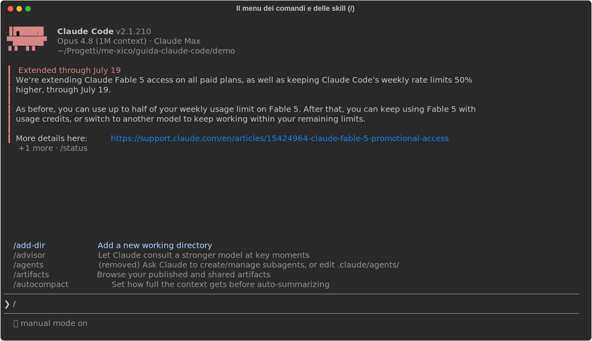
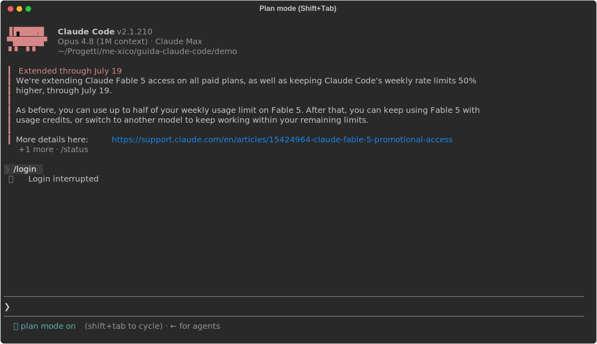
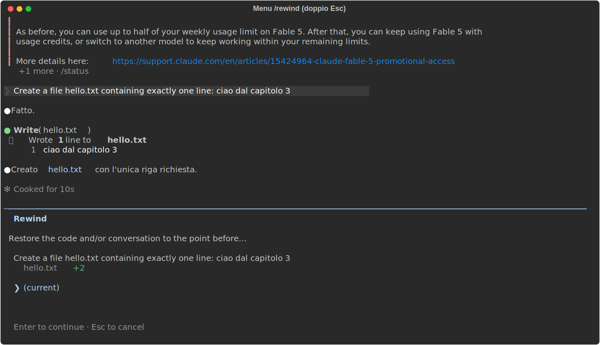
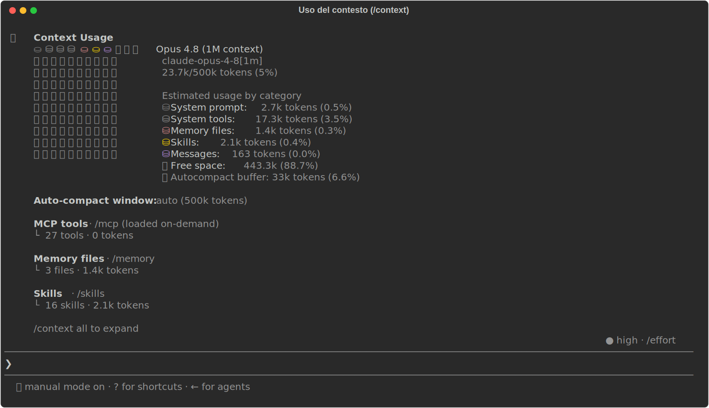
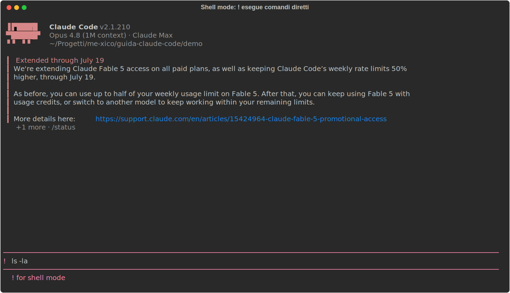
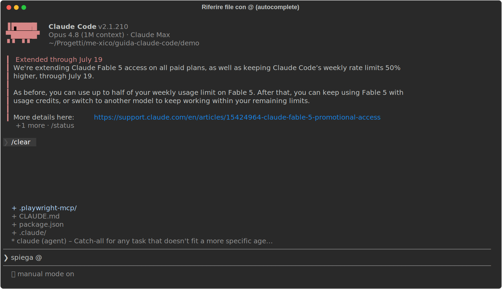
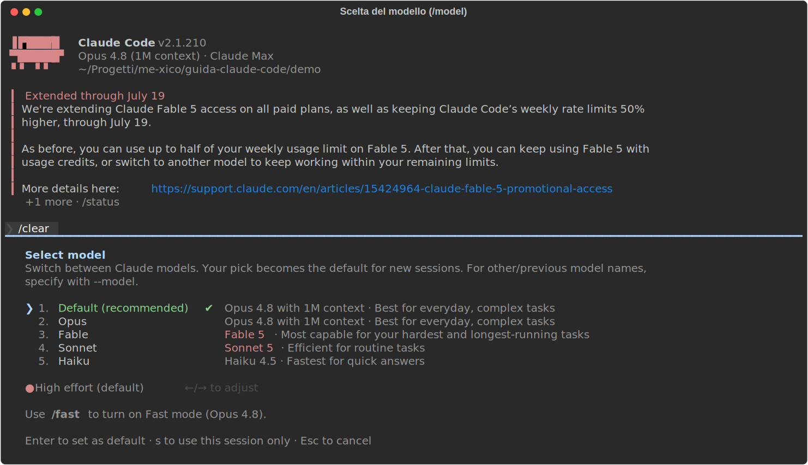

# 03 - Uso quotidiano

> Verificato il 15 luglio 2026 sulla doc ufficiale (v2.1.210).

Nel capitolo 02 hai configurato Claude Code; qui vediamo come ci si lavora
tutti i giorni. Prima però un concetto di interfaccia che userai in ogni
sezione di questo capitolo: i comandi slash.

## I comandi slash: il pannello di controllo

**Cosa sono**: comandi che iniziano con `/` (`/clear`, `/rewind`,
`/compact`…). Non sono prompt per il modello: sono ordini all'*applicazione*
Claude Code, pensa alla command palette di VS Code, ma testuale.

**Dove stanno**: ovunque tu possa scrivere un prompt. Digita `/` come primo
carattere e si apre il menu con tutti i comandi disponibili, ciascuno con la
sua descrizione; continua a scrivere per filtrare, frecce + Invio per
scegliere. Non serve impararli a memoria: il menu è l'indice.

Questo è il menu che appare digitando `/`: nota le descrizioni accanto a
ogni comando:

Nel menu compaiono anche le skill (cap. 05): comandi che puoi definire tu.

## Il flusso: Explore → Plan → Code → Commit

**Cos'è**: il pattern ufficiale per i task non banali. L'idea di fondo:
separare il *capire* dal *fare*, così correggi Claude su un piano di dieci
righe invece che su cento righe di codice già scritto.

Le quattro fasi in pratica:

1. **Explore** (in plan mode): "leggi `src/auth` e spiegami come funziona il
   login". Claude legge, cerca, riassume, ma non modifica nulla.
2. **Plan**: "prepara un piano di implementazione dettagliato". Claude
   produce il piano; con ++ctrl+g++ lo apri nel tuo editor e lo correggi
   *prima* che parta una sola riga di codice: è il momento in cui la
   revisione costa meno.
3. **Code**: approvi il piano e Claude implementa. All'approvazione ti chiede
   in che modalità procedere: auto, `acceptEdits`, o review manuale di ogni
   edit (i permission mode del cap. 02).
4. **Commit**: "committa con un messaggio descrittivo".

**Il plan mode, in concreto**: è uno dei permission mode, Claude può solo
leggere ed esplorare, mai scrivere. Si attiva ciclando con ++shift+tab++ (lo
stesso tasto cicla tutti i mode) oppure all'avvio con
`claude --permission-mode plan`. Sai di esserci perché lo dice la barra di
stato sotto il prompt, come qui:

È la modalità giusta anche solo per esplorare un codebase nuovo senza rischi:
"non può toccare nulla" è garantito dal permission system, non dalla buona
volontà del modello.

!!! tip "Quando saltare il piano"
    Se il diff si descrive in una frase (typo, rename, una riga di log), il
    plan mode è solo overhead. Vai diretto.

## Checkpoint e /rewind: la rete di sicurezza

**Cos'è**: l'undo di Claude Code. Ogni volta che Claude modifica un file
viene salvato un checkpoint, uno snapshot a cui puoi tornare, come i
restore point di git ma automatici e per-intervento.

**Dove sta**: premi ++esc++ ++esc++ (a input vuoto) oppure digita `/rewind`.
Si apre il menu di ripristino con la lista dei checkpoint:

**Come si usa**: scegli il punto a cui tornare e *cosa* ripristinare.

- **codice + conversazione**: torni indietro del tutto;
- **solo codice**: i file tornano com'erano, ma la conversazione resta
  (utile per dire "rifallo, ma stavolta così");
- **solo conversazione**: tieni il codice, riavvolgi la chat.
- "Summarize from here" / "up to here": non ripristina, comprime, metà
  sessione diventa un riassunto, l'altra resta intatta.

**Come cambia il modo di lavorare**: puoi far *tentare* a Claude una strada
rischiosa ("riscrivi lo store con Zustand, vediamo") sapendo che il ritorno
costa due tasti.

!!! warning "Due limiti da conoscere"
    Traccia **solo gli edit fatti da Claude**, non i comandi bash (`rm`,
    `mv`), non le tue modifiche a mano, e tiene gli ultimi 100 checkpoint.

## La regola dei 2 tentativi

Se hai corretto Claude due volte sullo stesso punto e ancora sbaglia, **non
insistere con la terza correzione**. Il motivo è meccanico: ogni tentativo
fallito e ogni tua correzione restano nel contesto, e Claude sta ormai
ragionando dentro una storia piena di falsi indizi. Meglio `/clear` e un
prompt riformulato da zero che incorpora quello che hai imparato: "fai X;
attenzione che Y non funziona perché Z". Una sessione pulita con un prompt
migliore batte quasi sempre una sessione lunga piena di correzioni
accumulate.

## Sessioni

Ogni conversazione è una **sessione**, salvata automaticamente: chiudere il
terminale non perde nulla. Le operazioni che servono davvero:

| Cosa | Come |
|---|---|
| Riprendi l'ultima | `claude --continue` |
| Scegli dal picker | `claude --resume` (o `/resume` in sessione) |
| Dai un nome | `claude -n nome` all'avvio, `/rename nome` in sessione |
| Riprendi per nome | `claude --resume nome` |
| Forka la sessione | `/branch [nome]`, esplori un'alternativa senza perdere il filo principale |

`/branch` merita una nota: crea una *diramazione* della sessione corrente,
come un branch git della conversazione. Provi una direzione diversa e, se non
convince, il filo principale è ancora lì.

## Gestione del contesto

**Cos'è il contesto**: la memoria di lavoro del modello, tutto ciò che
Claude "vede" quando genera la prossima risposta. È una finestra a capienza
fissa, e non contiene solo la chat: ci stanno il system prompt, le
definizioni dei tool, i file di memoria (CLAUDE.md, cap. 04), le skill, e poi
ogni tuo messaggio, ogni file letto, ogni output di comando. Una sessione
appena aperta ne consuma già una parte prima che tu scriva una parola.

**Dove lo vedi**: il comando `/context` mostra la griglia dell'uso per
categoria: è la radiografia della sessione. Guardala: ogni cella è una fetta
di finestra, le categorie in legenda dicono chi la sta occupando, e lo spazio
libero è quello che resta per il lavoro vero:

!!! note "Perché ti riguarda"
    Il contesto si riempie man mano che lavori, e più è pieno più le
    prestazioni degradano: Claude "dimentica" le istruzioni date all'inizio,
    ripete errori già corretti. Quasi tutte le buone abitudini di questa
    guida derivano da qui.

Gli strumenti:

- `/clear`: svuota la conversazione. Da usare **tra un task e l'altro,
  sempre**: il task nuovo non ha bisogno della storia del precedente. Niente
  panico: la sessione svuotata resta recuperabile con `/resume`.
- `/compact [istruzioni]`: da usare *dentro* un task lungo, quando la storia
  serve ancora ma pesa troppo: sostituisce la conversazione con un riassunto
  e riparte da lì. Le istruzioni opzionali dicono cosa preservare:
  `/compact tieni i path dei file e le decisioni sul routing`.
- `/context`: il check periodico di cui sopra (tienilo d'occhio in
  statusline, cap. 14).
- `/btw domanda`: la domanda laterale ("com'è la sintassi di `grid-area`?")
  che NON entra nella storia: risposta in overlay, contesto intatto. Piccola
  ma salva-sessioni.

## Scorciatoie e trucchi di input

La tabella di riferimento, poi i tre trucchi che meritano il dettaglio:

| Tasto | Effetto |
|---|---|
| ++esc++ | interrompe Claude (i tuoi messaggi in coda restano) |
| ++esc++ ++esc++ | input pieno: svuota la riga; input vuoto: apre `/rewind` |
| ++ctrl+c++ | primo: pulisce l'input; secondo: esce |
| ++shift+tab++ | cicla i permission mode (cap. 02) |
| `!comando` | shell mode: esegue il comando, output nel contesto |
| `@path` | riferisci un file (autocomplete) |
| ++ctrl+v++ | incolla un'immagine dagli appunti (fondamentale per il frontend: screenshot → "riproduci questo layout") |
| ++ctrl+o++ | transcript dettagliato (tool call, tempi, modello) |
| ++ctrl+r++ | ricerca nella storia |
| ++ctrl+b++ | manda in background il comando in corso |
| ++alt+t++ / ++option+t++ | toggle extended thinking (per i problemi difficili; su alcuni modelli è sempre attivo) |

**Shell mode (`!`)**: digita `!` come primo carattere e l'input cambia
aspetto, prompt rosa, hint "! for shell mode" in basso: non stai più
parlando col modello, stai scrivendo un comando per la tua shell. Il comando
viene eseguito direttamente e l'output finisce nel contesto, dove Claude lo
vede. È il modo più rapido per dargli un dato di realtà: `! npm run test` e
poi "sistema i test rossi". Ecco com'è l'input in shell mode:

**Riferire file con `@`**: digita `@` e parte l'autocomplete sui file del
progetto, continua a scrivere per filtrare, Invio per inserire il path.
Claude riceve il *riferimento* e va a leggersi il file da solo: più preciso
di "il file del bottone" e più economico che incollarne il contenuto
(cap. 14). Così appare l'autocomplete:

**Coda di messaggi**: mentre Claude lavora puoi scrivere e premere Invio: il
messaggio si accoda per il turno dopo. Non serve aspettare.

**Vim mode**: `/config` → Editor mode, per chi non può farne a meno.

## Cambiare modello: /model

`/model` apre il picker: scegli il modello e il livello di *effort* (quanto
ragionamento investire). Il default va bene per il lavoro quotidiano; quale
modello per quale task, e cosa costa, è il tema del cap. 14. Il picker:

## Due comandi che non ti aspetti

- `/recap`: riassunto della sessione. Il lunedì mattina, dopo
  `claude --continue`, risponde alla domanda "dov'eravamo?".
- `/goal condizione`: fissi una condizione di completamento che Claude non
  può dichiarare raggiunta finché non è vera (la meccanica nel cap. 11,
  dove è un gradino della scala della verifica).

---

**In sintesi**: plan mode per i task grossi, ++esc++ ++esc++ come undo
universale, `/clear` tra i task e la regola dei 2 tentativi quando ti
impantani. Il prossimo capitolo entra nel file più importante del tuo
setup: il CLAUDE.md.
