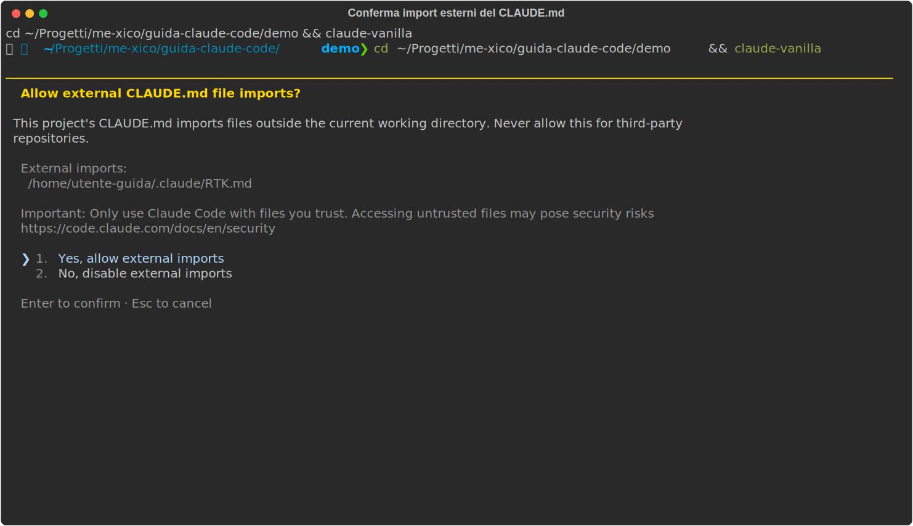

# 04 - CLAUDE.md and rules: the permanent instructions

> Verified on July 15, 2026 against the official docs (v2.1.210).
> Live example: [`demo/CLAUDE.md`](demo/CLAUDE.md).

## What it really is

**What it is**: CLAUDE.md is what Claude knows about your project *before*
you type your first prompt. The right analogy is the onboarding document for
a new coworker, except Claude is a new coworker *every single session*:
without this file it starts from scratch each time, rediscovers the
commands, gets the names of things wrong, repeats the same mistakes.

**Where it lives**: it's a plain Markdown file, `CLAUDE.md`, in the project
root. You create it yourself, or `/init` generates one for you by analyzing
the codebase and producing a starting point (decent, but prune it right
away: see below).

**How it works**: at session start, Claude Code finds it, loads it into the
context, and keeps it there for the whole session: it's part of the
"memory" you saw in the `/context` grid (ch. 03). No magic involved: it's
text that precedes every prompt you send. That's where the chapter's two
rules come from: every line costs context, and every line is always read.

It's the single file with the best effort-to-payoff ratio in your entire
setup.

## What goes in (and what doesn't)

The criterion: only include what Claude **would get wrong without it**:

- the project commands (`npm run test`, `npm run lint`) and when to run them
- non-obvious conventions: "CSS modules, no styled-components", "one
  component per file", "tests next to the component"
- the constraints: "TypeScript strict, no `any`"
- the known traps: "the router mock must be imported before the component,
  otherwise the tests break in cryptic ways"

Do NOT include what Claude can figure out on its own by looking at the
code: the directory tree, the dependency list, generic descriptions ("it's
a React app"). That's dead weight that burns context and dilutes the rules
that matter.

**How to write it**: look at [`demo/CLAUDE.md`](demo/CLAUDE.md), the actual
file from this guide's demo project: one framing line, the commands with
*when* to use them, the conventions. A taste:

```markdown
# demo-app

SPA React + TypeScript (Vite). Componenti in `src/components/`, un file per
componente, stile con CSS modules (niente styled-components).

## Comandi

- `npm run test` — test (Vitest); lanciali prima di dichiarare finito un task

## Convenzioni

- TypeScript strict: niente `any`, preferisci type inference dove possibile.
- I test stanno accanto al componente: `Button.tsx` → `Button.test.tsx`.
```

Note the style: imperative, specific sentences, no explanations. Every line
is an instruction that changes a behavior.

**The line test**: for each line, ask yourself "if I remove this, would
Claude get something wrong?". If not, cut it. Target: **under ~200 lines**.
The reason isn't aesthetic: models reliably follow a limited number of
instructions, and in a bloated CLAUDE.md the important rules drown among
the useless ones. The file stops working exactly where you needed it. Since
v2.1.206, `/doctor` will suggest the cuts itself.

## The pattern that keeps the file alive: the error log

The best CLAUDE.md isn't written in one afternoon: **it grows every time
Claude gets something wrong**. The cycle goes like this:

1. Claude makes a mistake (uses the deprecated command, gets the asset path
   wrong).
2. You correct it in chat, but the correction only lives in *this* session.
3. You transfer it into CLAUDE.md as a permanent line: "use X, not Y
   (deprecated)".
4. From tomorrow on, no session repeats that mistake.

At the end of a session, ask yourself (or ask Claude directly): "what did
you learn today that I won't have to re-explain tomorrow?". After a month
you'll have a file worth its weight in gold, one that no `/init` could ever
generate, because it encodes the mistakes of *your* project.

To edit it on the fly without leaving the session, there's `/memory`: it
lists all the loaded instruction files (CLAUDE.md at its various levels,
rules) and opens them in your editor.

## The levels (recap from ch. 02, with usage rules)

There isn't just one CLAUDE.md: at startup, Claude Code loads them in
order, from most general to most specific, and stacks them. Each level has
its own job:

| File | What for |
|---|---|
| `~/.claude/CLAUDE.md` | YOUR preferences, across all projects ("reply in Italian", "always use pnpm") |
| `./CLAUDE.md` | the PROJECT's conventions, committed: it's the team standard |
| `./CLAUDE.local.md` | your own notes on this project, gitignored ("my dev server runs on port 3001") |
| subfolder `CLAUDE.md` | monorepos: NOT loaded at startup, only when Claude works on files in that folder |

The practical dividing line: if a coworker cloning the repo would benefit
from the rule → `./CLAUDE.md` (committed); if it's about you or your
machine → `CLAUDE.local.md` or the user-level file.

**Imports**: `@docs/css-conventions.md` at the start of a line includes
that file in the CLAUDE.md, like an `import` (recursive, max 4 levels).
It's for modularizing: the main file stays short and the bulky sections
live in dedicated files. Watch out for the special case: if an import
points **outside** the project, Claude Code stops and asks for
confirmation, because a malicious CLAUDE.md in a third-party repo could use
imports to inject instructions into your session. This is the dialog, and
on a repo you don't know the answer is no:



## Rules: instructions with a scope

**What it is**: a rule is an instruction file with a *scope* delimited by
path globs. It solves a classic CLAUDE.md problem: "the test
rules only apply to test files, so why do they have to sit in the context
all the time, even when I'm working on CSS?"

**Where they live**: `.claude/rules/*.md` in the project (committable, like
CLAUDE.md) or `~/.claude/rules/` at the user level. One file per rule or
per area.

**How to write one**: Markdown with a YAML frontmatter declaring the paths
the rule applies to. Complete example:

```markdown
---
paths:
  - "src/**/*.test.ts"
---
# Test rules
- Use Testing Library, never enzyme.
- Each test has exactly one conceptual assertion.
```

The `paths:` field takes a list of globs (`**` = any subfolder). The body
is written like a CLAUDE.md: short, imperative instructions.

**How it works**: unlike CLAUDE.md, a rule is NOT always in the context. It
kicks in **only when Claude touches files matching the globs**: as long as
you're working in `src/styles/`, the test rule doesn't exist; the moment it
opens `Button.test.ts`, it activates. Result: a cleaner context and rules
that actually get followed (remember the limit on the number of
instructions?). It's the right place for per-area conventions in large
projects.

## An honest limitation

CLAUDE.md and rules are *advisory*: Claude follows them almost always, but
that's not enforcement. They're instructions to a model, not system-level
constraints. For things that must happen **no matter what** (formatting
after every edit, blocking a command), the right tool is hooks (ch. 07),
which are deterministic. Rule of thumb: preferences and knowledge →
CLAUDE.md; guarantees → hooks.

---

**In short**: start from `/init`, prune with the line test, stay under 200
lines, and grow the file with every mistake Claude makes. With this, the
Foundation is complete: the next leg of the journey is the Method, starting
with verification (ch. 11) — the most important chapter in this guide.
Skills and agents (ch. 05-06) come right after, and they'll pay off double
once you have the method in hand.
