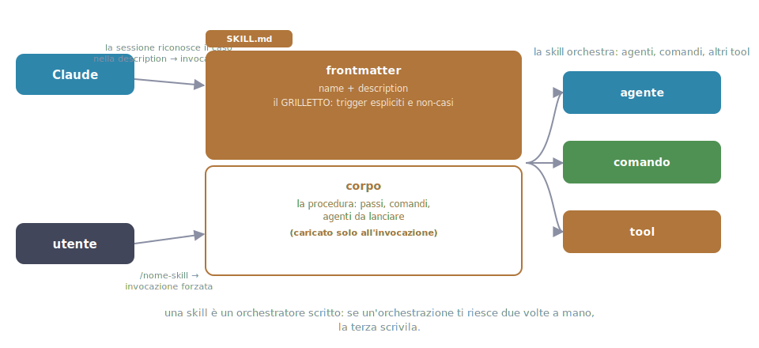

# 05 - Skills and slash commands

> Verified on July 15, 2026 against the official docs (v2.1.210).

## What a skill is, what it's for

A skill is a **packaged procedure**: a directory containing a `SKILL.md`
file that tells Claude, step by step, how to do one specific thing: the
pre-release check, fixing a GitHub issue, any routine you currently
re-explain by hand.

The analogy that holds up: a skill is a **recipe in a cookbook**. Claude
always keeps the index in view (name plus a one-line description for each
recipe), but only opens the page when it has to cook that dish. That's
*lazy* loading: until you use it, a skill costs zero context.

You'll recognize the problem it solves right away: you're pasting the same
instructions into chat for the third time, or your CLAUDE.md (ch. 04) is
swelling with long procedures you need one time out of ten. The official
split:

- **facts → CLAUDE.md**: always in context ("we use CSS modules", "tests
  live next to the component");
- **procedures → skills**: loaded on demand, zero cost when unused.

!!! tip "The signal to write one"
    You'll notice it when you catch yourself getting annoyed at repeating
    the same explanation: if an operation takes you twice by hand, the
    third time write it as a skill.

## Where it lives and who creates it

A skill is a directory containing at least a `SKILL.md`:

| Scope | Path | When |
|---|---|---|
| Personal | `~/.claude/skills/<nome>/SKILL.md` | your own procedures, valid everywhere |
| Project | `.claude/skills/<nome>/SKILL.md` | committed: the whole team uses it |
| Plugin | inside the plugin (ch. 09) | shipped with a plugin |
| Monorepo | `apps/web/.claude/skills/…` | activates when working there, or via `/apps/web:deploy` |

You create it yourself: by hand (it's just markdown) or, more
conveniently, by asking Claude to write it for you (more on that at the end
of the chapter). No restart needed: **changes are live**, save the file and
the skill is already updated in the current session.

A non-trivial skill can also carry supporting material:

```
.claude/skills/release-check/
├── SKILL.md          # frontmatter + procedure (keep it under ~500 lines)
├── references/       # detailed docs, loaded only if the skill needs them
└── assets/           # deterministic scripts, templates
```

`references/` and `assets/` are optional: they're for when the procedure
has long details you don't want inside `SKILL.md`, or helper scripts.

## How to write one

A complete, minimal `SKILL.md`: YAML frontmatter between the `---`, then
the body in markdown:

```markdown
---
name: release-check
description: Verifica pre-release di una SPA: build pulita, test verdi,
  bundle size sotto soglia. Usala quando l'utente dice "siamo pronti al
  rilascio?", "release check", "posso deployare?".
---

Esegui in ordine, fermandoti al primo problema:

1. Lancia la build di produzione: deve chiudersi pulita.
2. Lancia la suite di test: tutti verdi.
3. Controlla la dimensione del bundle rispetto alla soglia.
4. Riporta il verdetto (pronto / non pronto) con i dettagli.
```

| Part | What it's for |
|---|---|
| `name` | identifies the skill: it's the directory name and becomes the `/release-check` command |
| `description` | **the trigger**: the only thing Claude sees when deciding whether to activate it |
| body | the recipe: the instructions Claude follows once the skill activates |



The description deserves a pause, because it's where skills fail. Claude
doesn't read the body to decide: it reads *only* the description. So put
three things in it: **what the skill does**, **the phrases that should
trigger it** (literally: "use it when the user says…"), and, for sensitive
skills, **when NOT to trigger it**. A vague description produces a skill
that never fires, or fires at the wrong time.

## How it works, step by step

1. **At session start**, Claude loads the index of available skills: for
   each one, only `name` and `description`. The bodies stay on disk:
   near-zero context cost.
2. **On each request of yours**, Claude compares what you're asking against
   the descriptions. "Posso deployare?" matches the one for
   `release-check` → the skill activates. Alternatively, you trigger it
   yourself by typing `/release-check`.
3. **On activation**, Claude reads the whole `SKILL.md` and follows its
   body as if you had just pasted it into chat.
4. **If the body points to `references/`**, those files are read only at
   that point: a second layer of lazy loading.

Skills also show up in the `/` menu next to the built-in commands, the
same menu you saw in ch. 03 (`assets/03-slash-menu.svg`): type `/` and
they're right there, with their description as the subtitle.

Two control frontmatter fields govern *who* can invoke it:

- `disable-model-invocation: true`: only you can launch it, Claude won't
  trigger it on its own. Right for actions with side effects (deploy,
  commit).
- `user-invocable: false`: the opposite, Claude only, it disappears from
  the `/` menu.

## Arguments and the body's superpowers

A skill can take arguments and run commands before Claude even reads it.
Complete example:

```markdown
---
name: fix-issue
description: Resolves a GitHub issue by number
arguments: issue priority
argument-hint: [issue-number] [priority]
disable-model-invocation: true
---

Resolve issue #$issue with priority $priority:

## Current status
!`git status --short`

1. Read the issue, implement the fix, add tests.
2. Commit: "fix: #$issue"
```

Invocation: `/fix-issue 123 high`. What happens, line by line:

| Element | Mechanics |
|---|---|
| `arguments: issue priority` | declares named arguments: `123` lands in `$issue`, `high` in `$priority` |
| `argument-hint` | the hint you see in the `/` menu while typing |
| `$issue`, `$priority` | substituted into the body before Claude reads it (alternatives: `$ARGUMENTS` for everything, `$0`/`$1` by position) |
| `` !`git status --short` `` | **dynamic injection**: the command runs *before* Claude reads the skill and its output is pasted right there, so the skill starts with the right context already in hand (diff, status, log) without wasting turns |

Other frontmatter fields, useful when needed:

- `allowed-tools: Bash(git add *) …`: pre-approves those tools for the
  duration of the skill (no permission prompts mid-procedure);
- `model:` / `effort:`: run it on a different model or effort level;
- `context: fork`: runs it in a subagent, with a separate context (ch. 06).

## What about the old slash commands?

`.claude/commands/nome.md` still works: same frontmatter, same `/nome`
invocation. But it's the legacy format, a single file, with no
`references/` or `assets/`. If both exist with the same name, the skill
wins. Use skills for anything new; existing commands don't need rewriting,
migrate them only when you need the extra structure.

!!! note "Skill or legacy slash command?"
    Same frontmatter, same `/name` invocation: the only difference is the
    structure. The legacy command is a single file, the skill is a
    directory that can grow with `references/` and `assets/`.

## Built-in skills and how to create good ones

Claude Code ships with a few built in: `/code-review`, `/verify`, `/run`,
`/debug`, `/loop`, `/batch`. Opening and reading them is the quickest way
to learn the style.

To create one of your own, the most practical flow is: describe the
procedure to Claude in plain words ("when I do the release check, first I
run the build, then…") and ask it to write it up as a skill. Then **refine
the description** until it fires on the right phrases: it's a bit of
iterative work. There's also the official `skill-creator` plugin
(`/plugin install skill-creator@claude-plugins-official`) which adds test
cases and A/B testing of descriptions.

Official best practices: keep SKILL.md short and **imperative** ("do X",
not "one could do X"), details in `references/` loaded on demand, scripts
in `assets/` referenced via `${CLAUDE_SKILL_DIR}` so they work from any
directory.

---

**In short**: every time you catch yourself re-explaining a procedure,
that's a skill waiting to be born. Description = trigger, body = recipe,
lazy loading = clean context. Next chapter: agents, or who to delegate to.
