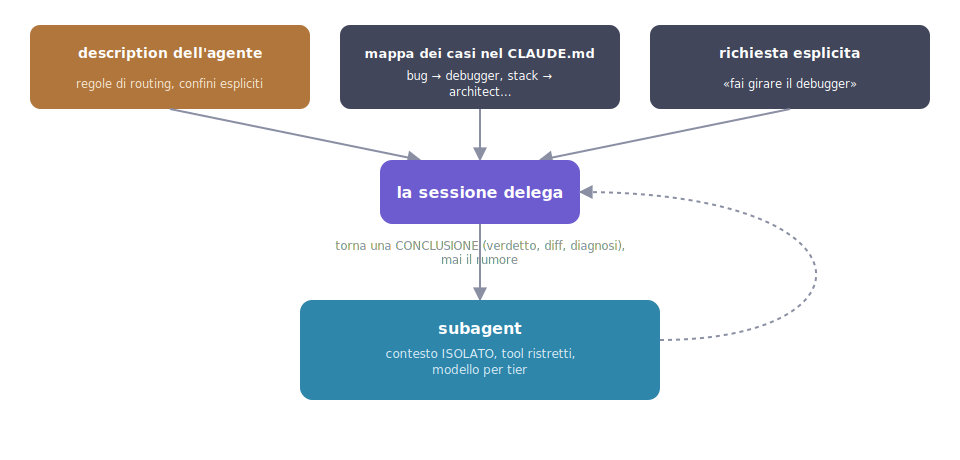

# 06 - Agents (subagents): who to delegate to

> Verified on July 15, 2026 against the official docs (v2.1.210).

## What a subagent is, what it's for

A subagent is a **disposable collaborator**: an instance of Claude that
starts with its own role, its own tools and, above all, its own
**separate, clean context**. The analogy: you hand a well-written task to a
coworker, they work at *their* desk, and report back only the summary. The
scattered papers stay on their side.

The deep reason they exist is **context**: a codebase search or a verbose
test suite can burn half your session's context window with output you
have no reason to keep. The subagent does the dirty work in its own
context and brings back only the conclusion. You keep the summary, not the
logs.

!!! note "Isolated context"
    The noise (greps, test logs, files read) stays in the subagent's
    context and disappears with it at the end of the task. Only the
    summary reaches your session: it's worth delegating even a short task
    if it produces verbose output.

Second reason: **narrowing powers**. A reviewer with read-only tools can't
"fix" things on its own initiative while it's judging.

## Where it lives and who creates it

An agent is a single markdown file:

| Scope | Path |
|---|---|
| Personal | `~/.claude/agents/<nome>.md` |
| Project | `.claude/agents/<nome>.md` (committed: the whole team uses it) |

You create it yourself, and there's no wizard: either edit the file by
hand, or ask Claude to make it for you ("create a code-reviewer agent for
this project"). Changes are live: save the file and the agent is already
updated in the session.

## How to write one

A realistic, complete example for a frontend project,
`.claude/agents/code-reviewer.md`:

```markdown
---
name: code-reviewer
description: Reviews code for quality, a11y and security. Use proactively
  after writing or modifying components.
tools: Read, Grep, Glob, Bash
model: sonnet
---

You are a senior frontend reviewer. When invoked:
1. Look at the recent diff.
2. Check: correctness, accessibility (labels, focus, contrast),
   render performance (unnecessary re-renders), security (XSS, injections).
3. Return a checklist of findings (critical / warning / suggestion)
   with file:line references. You review, you do NOT edit.
```

| Field | What it's for |
|---|---|
| `name` | the name the agent is invoked and displayed by |
| `description` | **the trigger**, just like for skills: the main agent reads it to decide when to delegate. "Use proactively" encourages automatic delegation; also state what the agent does NOT do |
| `tools` | the tool allowlist: grant only what's needed (`Read, Grep, Glob, Bash` for a read-only agent) |
| `model` | `haiku` for mechanical work (lint, running tests), `sonnet` for reviews; omit to inherit from the main agent |
| body | the agent's **system prompt**: who it is, what it does when invoked, what format it answers in |

!!! tip "The description is the routing rule"
    Just as with skills, the main agent decides who to delegate to by
    reading the descriptions of all available agents. Write it thinking
    about *when* the delegation should trigger, not just what the agent
    does.

Note the example's body: it defines the role, the steps, the output format
and the boundary ("you do NOT edit"). That's the pattern to copy.

Advanced fields when you need them: `maxTurns` (a cap on turns), `memory`
(the agent accumulates knowledge across sessions), `isolation: worktree`
(a separate git checkout: multiple agents *writing* in parallel without
stepping on each other), `permissionMode`, `effort`.

## How it works, step by step

1. The main agent knows the available agents through their
   **descriptions** (exactly as with skills: the description is the
   delegation trigger).
2. When it decides to delegate (on its own, or because you ask it to), it
   writes a **delegation prompt**: the task to carry out.
3. The subagent starts with a **fresh** context: its system prompt (the
   file body), the delegation prompt, CLAUDE.md and memory. It does not
   see your conversation.
4. It works with only the tools in its allowlist; all the noisy output
   (greps, test logs, files read) stays in *its* context.
5. At the end it returns its final message, the summary, which is the only
   thing that enters your session.

To invoke it explicitly: name it in the prompt ("use the code-reviewer on
the new components") or guarantee the delegation with an @-mention:
`@"code-reviewer (agent)"`.



### Foreground and background

Since 2.1.198, subagents run in the **background by default**: your
session keeps going while they work, and you get notified when they
finish. `/tasks` (or `Ctrl+T`) shows what's running; permission requests
from background agents still surface to you: they don't get
auto-approved.

## What the subagent sees (and what it doesn't)

| Gets | Doesn't get |
|---|---|
| the delegation prompt | your conversation history |
| its own system prompt | the files the main agent already read |
| CLAUDE.md and memory | the skills invoked by the main agent |

The practical consequence, and it's the classic mistake: **the delegation
prompt must be self-sufficient**, with exact paths, constraints, and the
expected output format. Assuming the agent "knows what we were talking
about" doesn't work: it doesn't, and it will work off its own guesses.

## The built-in ones

- **Explore**: read-only codebase searches; use it freely, it's the
  standard way to "figure out where X is" without dirtying your context.
- **Plan**: the reconnaissance that feeds plan mode (ch. 03).
- **general-purpose**: a multi-step jack-of-all-trades with every tool.

## When NOT to use them

- Small, targeted edit: the delegation round-trip costs more than the work.
- Task that needs back-and-forth with you: the subagent can't see you.
- Phases that share a lot of context: re-explaining it to each agent costs
  more than keeping it in the session.

There's also an experimental **agent teams** mode where agents talk to
each other (`CLAUDE_CODE_EXPERIMENTAL_AGENT_TEAMS=1`): know that it
exists, but to get started, subagents are more than enough.

---

**In short**: delegate the noisy stuff (searches, tests, reviews) to
agents and stay the owner of your context. Clear description, minimal
tools, self-sufficient delegation prompt. Next chapter: hooks, where rules
stop being suggestions.
