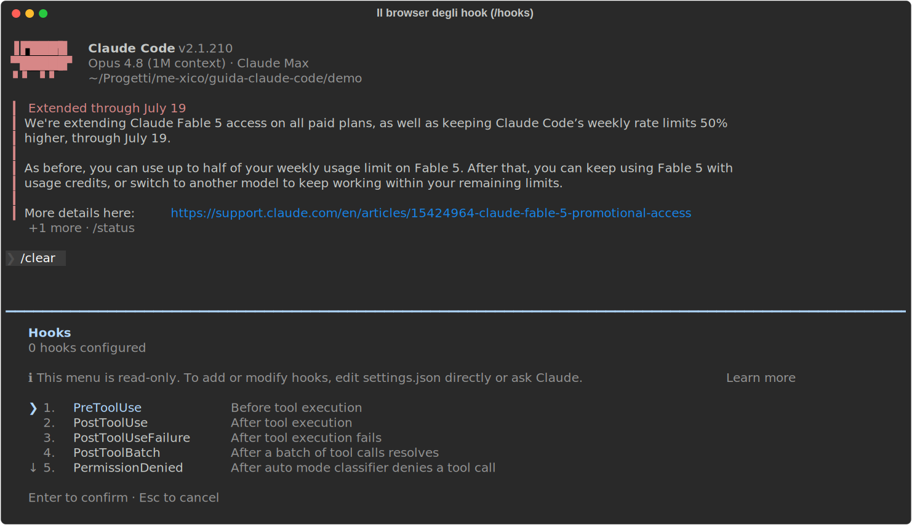
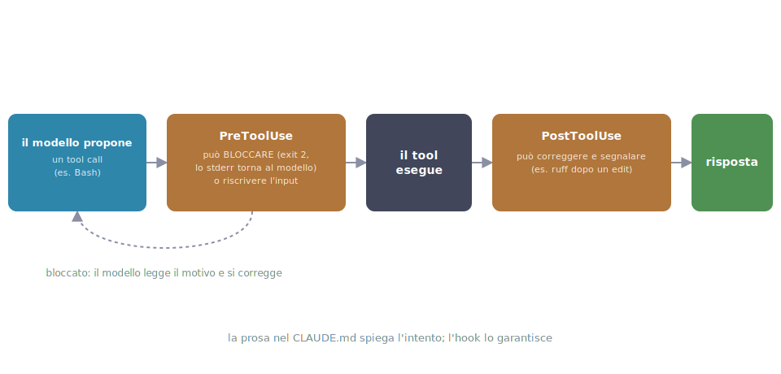

# 07 - Hooks: when rules stop being suggestions

> Verified on July 15, 2026 against the official docs (v2.1.210).

## What a hook is, and what it's for

Everything you write in CLAUDE.md is *advisory*: Claude follows it almost
always, but "almost" isn't "always". A hook, by contrast, is
**deterministic**: a script the *system* runs at a precise event, every
time, whether Claude likes it or not. The analogy: CLAUDE.md is the "please
punch your ticket" sign, a hook is the **turnstile**: nobody gets through
without it. Rule of thumb for splitting things up: preferences and knowledge
→ CLAUDE.md; **guarantees → hooks**.

!!! warning "Rules that always apply, not almost always"
    A non-obvious bonus: a `deny` enforced by a `PreToolUse` hook holds even
    in `bypassPermissions`: it's the one guardrail no mode can override.

## Where it lives and who creates it

Hooks are declared under the `"hooks"` key of the `settings.json` files you
already know from ch. 02: user (`~/.claude/settings.json`), project
(`.claude/settings.json`, via git) or local (`.claude/settings.local.json`),
and the definitions **add up** across levels. You write them by editing the
JSON (or asking Claude to do it); they are loaded by the system, not by the
model.

In a session, `/hooks` opens a read-only browser: the list of all available
events and how many hooks you have configured on each.



## How to write one

The **most useful hook for a frontend dev** (an official example): after
every edit Claude makes, Prettier formats the file.

```json
{
  "hooks": {
    "PostToolUse": [
      {
        "matcher": "Edit|Write",
        "hooks": [
          {
            "type": "command",
            "command": "jq -r '.tool_input.file_path' | xargs npx prettier --write"
          }
        ]
      }
    ]
  }
}
```

Let's take it apart piece by piece:

| Element | Meaning |
|---|---|
| `"PostToolUse"` | the **event**: this block fires after every tool use |
| `"matcher": "Edit\|Write"` | the **filter**: only if the tool is named `Edit` or `Write` (the `\|` means "or") |
| `"hooks": [...]` | the list of scripts to run when event + matcher line up |
| `"type": "command"` | the hook type: a shell command (see "Beyond scripts" for the others) |
| `"command"` | the script: it reads the event's JSON from stdin, `jq` extracts `.tool_input.file_path`, `xargs` hands it to Prettier |

The result: CI will never fail on formatting again. Not because Claude
"remembers", but because there's no other way it can go.

## How it works, step by step

<div class="percorso" markdown>



<div class="percorso-step" markdown data-highlight="p-propone">**1 · The model proposes.** Claude decides to use a tool and proposes the call, say a Bash command. It's only a proposal: nothing has happened yet.</div>
<div class="percorso-step" markdown data-highlight="p-propone p-pre">**2 · PreToolUse checks first.** The hook gets the event's JSON on stdin and decides: `exit 2` blocks the action (stderr goes back to Claude as the explanation), or it rewrites the input on the fly.</div>
<div class="percorso-step" markdown data-highlight="p-pre p-tool">**3 · The tool runs.** If PreToolUse didn't block it, the tool actually executes: it reads, writes, runs the command.</div>
<div class="percorso-step" markdown data-highlight="p-tool p-post">**4 · PostToolUse fixes and flags.** After execution another hook steps in: autoformat, lint, logging the command that just ran.</div>
<div class="percorso-step" markdown data-highlight="p-pre p-loop">**5 · The block loop returns to the model.** When PreToolUse blocks, stderr isn't lost: it reaches Claude, which reads the reason and corrects itself, no need for you to step in.</div>
<div class="percorso-step" markdown data-highlight="p-propone p-pre p-tool p-post p-risposta p-loop p-nota">**6 · The response is guaranteed, not hoped for.** Passed straight through or fixed along the way, the rule holds either way: not because Claude remembers, but because the turnstile enforced it.</div>

</div>

1. Claude is about to use (or has just used) a tool → the matching event
   fires.
2. The system selects the hooks configured on that event whose `matcher`
   matches.
3. Each hook receives **a JSON on stdin** with the details: `tool_name`,
   `tool_input` (with `file_path`, `command`…), `cwd`.
4. The script does its job and answers with its **exit code**:
   - `0` = all good; for some events the stdout is injected into Claude's
     context (that's how a hook "talks" to it);
   - `2` = **block the action**, and stderr goes back to Claude as the
     explanation of why.
5. Claude can neither override nor negotiate: everything happens outside
   the model.

## The events you'll actually use

| Event | Fires… | Typical use |
|---|---|---|
| `PreToolUse` | before a tool | block/filter commands and files |
| `PostToolUse` | after a tool | autoformat, lint, command logging |
| `Stop` | when Claude finishes its turn | run the tests as a gate (ch. 11) |
| `UserPromptSubmit` | on each prompt of yours | inject context, validate |
| `SessionStart` | startup / `/clear` / after compact | reload rules or env |
| `Notification` | Claude asks for permission or goes idle | desktop notification |
| `PreCompact` / `PostCompact` | around compaction | save/re-inject context |

(The full list has ~30 events: it's the one you see in the `/hooks` browser
above.)

## Three ready-to-use official examples

**Protecting the files Claude must not touch**. `PreToolUse` with matcher
`Edit|Write`: a script that reads the `file_path` from stdin and exits with
`2` if it matches `.env`, `.git/` or `package-lock.json`. The permission
deny (ch. 02) covers reads; this covers writes, with arbitrary logic,
because you're the one writing the script.

**Desktop notification when your ok is needed**. `Notification` with matcher
`permission_prompt`: `notify-send` on Linux, `osascript` on macOS. Kick off
a long task, go do something else: it calls you back.

**Rules that survive compaction**. `SessionStart` with matcher `compact`:
`echo 'Reminder: use Bun, not npm.'`, and the stdout gets injected into the
fresh context (the "exit 0 + stdout" case from step 4 above).

## Beyond scripts

`type` isn't just `command`: there are `prompt` hooks (a call to a small
model that answers `{"ok": true/false}`, "is this command dangerous?"),
`agent` hooks (a multi-turn verification subagent, ch. 06) and `http`
(webhooks). Hooks can also be defined in the frontmatter of skills and
agents, where they only apply while those are active, and in plugins
(ch. 09).

## Security

Hooks run **with your credentials and without confirmation**: read any hook
before copying it off the internet, and treat the project's `settings.json`
as code to review (it arrives via git from the team). This is real power:
use it for guardrails, not for magic.

---

**In short**: one hook for formatting (right away), one for forbidden
files, one for notifications. When you catch yourself *hoping* Claude does
something every single time, that something wants to become a hook. Next
chapter: MCP, or giving Claude new eyes and hands.
