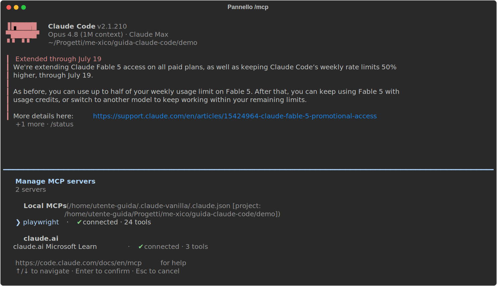

# 08 - MCP: dare occhi e mani nuove a Claude

> Verificato il 15 luglio 2026 sulla doc ufficiale (v2.1.210).

## Cos'è e a che serve

Il Model Context Protocol è lo standard con cui Claude Code si collega a
strumenti esterni: un browser, Figma, GitHub, il tuo database. L'analogia
giusta è una **presa elettrica**: un server MCP è una presa a cui Claude
attacca nuovi sensi e nuove mani. Di fabbrica, Claude Code sa leggere e
scrivere file e lanciare comandi shell; ogni server MCP collegato gli
aggiunge capacità che da solo non ha.

Concretamente, un server può portare tre cose:

- **tool**: azioni nuove che Claude può eseguire ("apri questa pagina nel
  browser", "elenca le issue di GitHub");
- **risorse**: dati che tu puoi riferire in chat come fossero file;
- **prompt**: comandi pronti che il server mette a disposizione.

I tool sono la parte che userai sempre; risorse e prompt sono bonus che
vediamo più avanti.

## Come si aggiunge un server

Il comando è `claude mcp add`, dal terminale (non in sessione). La forma
cambia a seconda di *dove gira* il server.

**Server locale (stdio)**. Un processo che Claude Code avvia sulla tua
macchina e con cui parla via stdin/stdout:

```bash
claude mcp add playwright -- npx -y @playwright/mcp@latest
```

Leggiamolo pezzo per pezzo: `playwright` è il **nome** che dai tu al server
(lo ritroverai ovunque: nei permessi, in `/mcp`, nei nomi dei tool); il
`--` è un **separatore obbligatorio**: tutto ciò che sta a destra è il
comando che avvia il server, non opzioni di `claude mcp`; `npx -y
@playwright/mcp@latest` è quel comando (il `-y` evita la conferma
interattiva di npx, che bloccherebbe l'avvio automatico).

**Server remoto (HTTP)**. Un servizio che gira altrove, tipicamente
gestito dal fornitore; qui non c'è nessun processo da avviare, solo un URL:

```bash
claude mcp add --transport http figma https://mcp.figma.com/mcp
```

`--transport http` dice a Claude Code che deve *connettersi* invece di
*eseguire*; `figma` è di nuovo il nome scelto da te; l'URL è l'endpoint del
servizio.

**Gestione**: tre comandi da conoscere:

```bash
claude mcp list      # tutti i server configurati, con stato di connessione
claude mcp get nome  # dettagli di un server
claude mcp remove nome
```

## Come funziona: cosa succede all'avvio

All'avvio di una sessione, Claude Code legge la lista dei server
configurati, avvia i processi stdio e si connette agli endpoint HTTP. Ogni
server risponde dichiarando i tool che offre, e da quel momento quei tool
esistono per Claude accanto a quelli nativi (Read, Bash…). Tu non fai
nulla: chiedi "apri la homepage e dimmi cosa vedi" e Claude sceglie il tool
del server giusto, come sceglierebbe Read per un file.

I server remoti spesso richiedono un login OAuth: dopo l'add appare
"Needs authentication". Si risolve in sessione: `/mcp` → seleziona il
server → Authenticate (si apre il browser per il login), oppure da CLI
con `claude mcp login nome`.

Il pannello `/mcp` è anche il cruscotto di controllo:



Cosa notare nella schermata: il pannello ha **due sezioni**. In alto i
**Local MCPs**, cioè i server configurati da te su questa macchina: per
ciascuno vedi lo **stato** (connected o failed: la prima cosa da guardare
quando "Claude non vede il browser") e il **numero di tool** che porta
(qui Playwright connesso con 24 tool). Sotto, i **connector di claude.ai**:
integrazioni collegate al tuo account, che ti ritrovi in Claude Code senza
averle configurate localmente.

## Gli scope: dove sta la configurazione

`claude mcp add` scrive la configurazione in uno di tre posti, scelto con
`--scope`. La domanda a cui rispondono è: *chi deve avere questo server?*

| Scope | Dove | Per chi |
|---|---|---|
| `local` (default) | config personale, per questo progetto | te |
| `project` | **`.mcp.json` nella root, committato** | tutto il team |
| `user` | config personale, tutti i progetti | te, ovunque |

`local` e `user` vivono nella tua config personale, fuori dal repo: sono
affari tuoi. `project` invece scrive un file **`.mcp.json` nella root del
progetto**, pensato per essere committato: è così che si condivide lo
stack col team. Chi clona il repo si ritrova i server già configurati.

!!! tip "Lo scope giusto è il più basso che serve"
    `local` per gli esperimenti tuoi, `project` solo quando il server va
    davvero condiviso col team, `user` solo per quello che usi ovunque. Il
    default (`local`) è già la scelta prudente: alzalo solo se serve.

Ecco un `.mcp.json` completo:

```json
{
  "mcpServers": {
    "playwright": {
      "type": "stdio",
      "command": "npx",
      "args": ["-y", "@playwright/mcp@latest"]
    }
  }
}
```

La struttura ricalca il comando CLI: `mcpServers` è la mappa
nome → definizione; `"type": "stdio"` dice come parlare col server;
`command` e `args` sono il comando di avvio, spezzato in eseguibile e
argomenti (quello che sul terminale stava a destra del `--`).

Due meccanismi di sicurezza legati a questo file. Primo: alla prima
apertura del progetto, Claude Code ti mostra i server elencati e **chiede
se ti fidi**: sono processi che gireranno sulla tua macchina con i tuoi
permessi, e il file l'ha scritto qualcun altro; la fiducia è meritata, non
automatica. Secondo: nei valori puoi usare `${VAR}` o `${VAR:-default}`,
espansi dall'ambiente al momento dell'avvio. Le API key restano nelle
variabili d'ambiente di ciascuno, mai committate nel JSON.

## Come appaiono i tool a Claude

Ogni tool MCP ha un nome con schema fisso: `mcp__server__tool`, ad
esempio `mcp__github__list_issues` è il tool `list_issues` del server che
hai chiamato `github`. Questo schema è utile soprattutto nei **permessi**
(cap. 02), dove il wildcard ti permette di approvare un server intero in
un colpo:

```json
"allow": ["mcp__playwright__*"]
```

Un dubbio legittimo: dieci server per centinaia di tool non intasano il
contesto? Dal 2026 no: gli schemi dei tool si caricano **on-demand**
(tool search): Claude vede l'elenco dei nomi, ma la definizione completa
di un tool entra nel contesto solo quando serve davvero.

E i due bonus promessi all'inizio, spesso ignorati:

- le **risorse** si riferiscono con `@server:protocollo://path`, ad
  esempio `@github:issue://123` porta quella issue nel contesto, con la
  stessa sintassi `@` che usi per i file (cap. 03);
- i **prompt** dei server diventano slash command:
  `/mcp__github__pr_review 456` esegue il prompt `pr_review` del server
  GitHub con l'argomento `456`.

## Quali server, per un frontend dev

I quattro che contano sono nel capitolo 10 (Playwright, l'estensione
Chrome, Chrome DevTools, Figma), con il workflow completo. Qui la regola generale, che
vale per qualunque server: **ogni server è codice che gira con i tuoi
permessi**. Quindi: aggiungi quello che usi, rimuovi quello che non usi
(un `claude mcp list` ogni tanto come pulizia), fidati solo di fonti note.
E se un tool restituisce output enormi (capita, con le pagine web),
`MAX_MCP_OUTPUT_TOKENS` nei settings mette un tetto a quanto ne entra nel
contesto.

!!! warning "Superficie di rischio"
    Un server MCP è codice che gira sulla tua macchina con i tuoi permessi.
    Vale la stessa cautela degli hook (cap. 07): installa solo quello che
    usi, da fonti che conosci, e ripulisci quello che non serve più.

---

**In sintesi**: `claude mcp add` per te, `.mcp.json` committato per il
team, `/mcp` per stato e autenticazione. MCP è il moltiplicatore: da solo
Claude vede il filesystem, con MCP vede il tuo browser e il tuo design
system. Il prossimo capitolo mostra come impacchettare tutto questo; quello
dopo è il workflow frontend vero e proprio.
