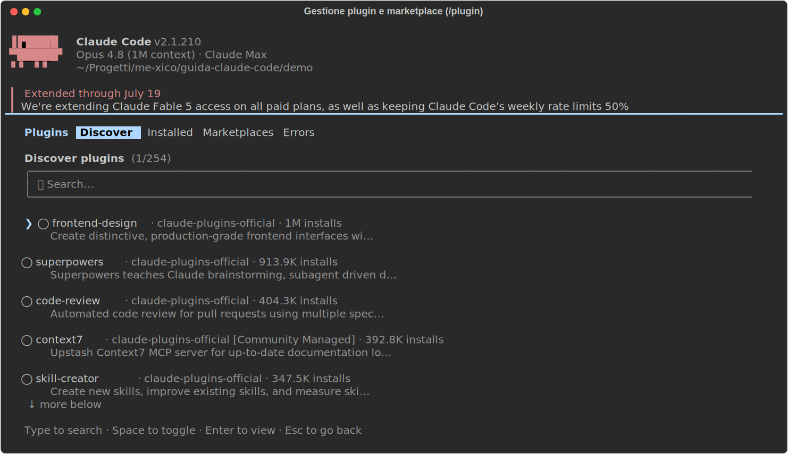

# 09 - Plugin: il setup in un pacchetto

> Verificato il 15 luglio 2026 (v2.1.210).

## Cosa sono e a che servono

Un plugin impacchetta in un'unica unità installabile tutto quello che hai
visto nei capitoli 5–8: **skill, agenti, hook e server MCP** (più eventuali
temi e comandi). L'analogia è il package manager: come `npm install` ti
porta una libreria con tutte le sue parti invece di file da copiare a mano,
`/plugin install` ti porta un setup completo di Claude Code. È la
differenza tra "copia questi cinque file nel posto giusto e configura tre
chiavi" e un comando solo.

## Dove sta: la struttura

Un plugin è una directory (tipicamente un repo Git) con una struttura che
riconoscerai subito, perché ricalca i capitoli precedenti:

```
mio-plugin/
├── manifest.json     # nome, versione, descrizione
├── skills/           # le skill (cap. 05)
├── agents/           # gli agenti (cap. 06)
├── hooks/hooks.json  # gli hook (cap. 07)
└── .mcp.json         # i server MCP (cap. 08)
```

Il `manifest.json` è la carta d'identità (nome, versione, descrizione);
le altre directory contengono esattamente i file che nei capitoli 5–8
mettevi in `.claude/`. Qui viaggiano insieme, versionati come un'unica
cosa. Quando il plugin è installato, Claude Code carica quei contenuti
all'avvio della sessione come se fossero tuoi: le skill compaiono tra le
slash command, gli hook si agganciano agli eventi, i server MCP si avviano.

## Come si installa e si gestisce

Tutto in sessione, a partire da `/plugin`:

```
/plugin                              # sfoglia marketplace e plugin installati
/plugin install nome@marketplace
/reload-plugins                      # ricarica dopo modifiche ai file del plugin
```

`/plugin` da solo apre il pannello di gestione:



Da qui sfogli i marketplace, vedi cosa c'è dentro ogni plugin **prima** di
installarlo, e gestisci quelli già installati. L'install si fa da pannello
o direttamente con `/plugin install nome@marketplace`, la parte dopo la
`@` dice da quale marketplace prendere il plugin. `/reload-plugins` serve
quando sviluppi un plugin tuo: modifichi i file e ricarichi senza
riavviare la sessione.

## Come funziona sotto: settings e marketplace

Cosa scrive davvero un'installazione? Due chiavi nel tuo `settings.json`,
utile conoscerle per capire cosa c'è nella propria config:

```json
{
  "enabledPlugins": { "nome@marketplace": true },
  "extraKnownMarketplaces": {
    "mio-marketplace": { "source": { "source": "github", "repo": "utente/repo" } }
  }
}
```

`enabledPlugins` è l'elenco di ciò che è attivo: la chiave è
`nome@marketplace`, il valore `true`/`false` accende o spegne il plugin.
`extraKnownMarketplaces` registra i marketplace di terze parti: qui uno
che vive su GitHub, indicato con `"source": "github"` e il `repo` in forma
`utente/repo`.

E un marketplace cos'è? Poco più di **un repo Git con un indice** dei
plugin che contiene. Ne esiste uno ufficiale, `claude-plugins-official`
(es. `/plugin install skill-creator@claude-plugins-official`, citato nel
cap. 05), e puoi aggiungerne di terze parti come sopra, anche uno tuo.

## Quando un plugin invece di config sparsa

- **Per il team**: lo standard aziendale (hook di format, agente di review,
  skill di deploy) diventa UN pacchetto versionato che tutti installano e
  aggiornano, invece di file copiati che divergono silenziosamente.
- **Per te**: se ti ritrovi a rifare lo stesso setup su ogni macchina o
  progetto, un plugin personale su un repo GitHub è il tuo "dotfiles" di
  Claude Code.
- **Dalla community**: prima di costruire, guarda cosa esiste: browser
  automation, code intelligence, integrazioni; spesso c'è già un plugin.

Attenzione simmetrica a quella degli hook (cap. 07): un plugin può portare
hook e MCP server, cioè **codice che gira con le tue credenziali**.
Installa da fonti di cui ti fidi, e leggi cosa contiene. Il pannello
`/plugin` lo mostra proprio per questo.

## Esempio dal vivo

Questa guida è stata scritta su una macchina con un plugin installato da un
marketplace GitHub di terze parti: porta una persona di review ("lazy
senior dev") con le sue skill e un hook SessionStart che la attiva a ogni
sessione. Un solo `install`, e cinque skill più un hook sono arrivati
insieme, e con `/plugin uninstall` se ne andrebbero altrettanto in blocco.
Questo è il punto dei plugin.

---

**In sintesi**: quando il tuo setup diventa buono, il plugin è come lo
condividi (col team o con te stesso del futuro). Prossimo capitolo: il
workflow frontend con un browser vero.
