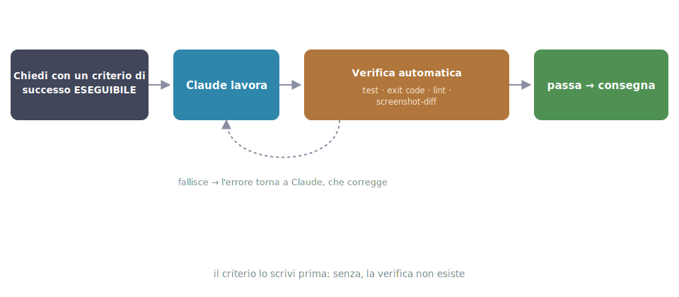

# 11 - Verification: the most important principle in this whole guide

> Source: official best practices ("the single most impactful tip in this
> guide is verification") + docs on hooks and /goal, July 2026.

## The problem

A scenario that sooner or later happens to everyone: you ask for a change,
Claude works for a few minutes, wraps up with a reassuring "done, it works
now", you trust it, you merge. At 6:30 pm you discover the payment form no
longer submits anything. The code *looked* right. The message *sounded*
confident. But nobody had actually verified anything: not Claude, not you.

The difference between a session you have to babysit line by line and one
you can walk away from comes down to one thing: **does Claude have a way to
verify its own work?** If yes, the loop becomes work → check → fix →
repeat until it passes, without you in the middle. If no, you are the test
runner, and you're also the bottleneck.

<div class="percorso" markdown>



<div class="percorso-step" markdown data-highlight="p-chiedi">**1 · The criterion comes first.** Your prompt already states how the result gets checked: a test, a command, an exit code. Without this step, the rest of the cycle doesn't exist.</div>
<div class="percorso-step" markdown data-highlight="p-chiedi p-lavora">**2 · Claude works.** It reads, edits, runs. You're not supervising line by line: you're waiting for the verdict.</div>
<div class="percorso-step" markdown data-highlight="p-lavora p-verifica">**3 · Verification runs on its own.** Tests, exit codes, lint, screenshot diffs: it's the criterion from step 1 turned into a machine.</div>
<div class="percorso-step" markdown data-highlight="p-lavora p-verifica p-ritorno">**4 · On failure, the error goes back to Claude.** It fixes and retries: the loop is closed and doesn't need you in the middle.</div>
<div class="percorso-step" markdown data-highlight="p-chiedi p-lavora p-verifica p-ritorno p-consegna p-morale">**5 · When it passes, ship.** The full cycle: criterion first, automatic verification, correction in between.</div>

</div>

## How to apply it: give Claude an executable criterion

For a frontend dev, the "ways to verify" are concrete and almost always
already in the project:

| Method | When to use it | What it catches |
|---|---|---|
| **Tests** | write the tests first (they must fail), then implement until they pass | functional regressions; TDD pairs with Claude better than it does with humans, because a failing test is a signal the model can read and chase on its own |
| **Build's exit code** | `npm run build` exiting 0 | a broken build before it reaches deploy |
| **Lint/typecheck** | `tsc --noEmit` | type errors, before the code even runs |
| **Screenshot compared against the mock** | "here's the design; implement it, take a screenshot, compare, list the differences, fix them" (ch. 10) | visual deviations from the design that tests don't see |

!!! tip "An executable success criterion"
    A complete prompt, to pin down the shape:

    ```text title="Prompt"
    Add validation to @src/components/CheckoutForm.tsx: email required
    and in a valid format, ZIP code with 5 digits. First write the Vitest
    tests for these cases (they must fail), then implement. Consider it
    done only when npm test passes and tsc --noEmit exits clean.
    ```

    Note the structure: what to do, how to verify it, when to stop. The
    verification criterion costs one extra line and changes everything
    that comes before it.

## Why it works

Without a criterion, "done" is the model's judgment about itself, and the
model, like anyone who has just written some code, tends to believe it.
With an executable criterion, "done" becomes an observable fact: the test
passes or it doesn't. Claude can iterate against that fact on its own, and
every iteration burns *its* time, not yours.

## Ask for evidence, not assertions

!!! warning "Trust without verification"
    "Done, it works now" is not information: it's a hope.

The countermove is always the same question, in three variants:

> "Show me the test output."
> "Paste the build's exit code."
> "Take a screenshot of the component as it is right now."

Reviewing the **evidence** is much faster than re-verifying everything by
hand. And there's a valuable side effect: Claude, knowing it will have to
produce that evidence, works better, exactly like a junior who knows the
PR will actually be read.

*The signal to watch for*: you notice you're about to accept a "done" on
its word. Stop right there and ask for the evidence.

## The verification ladder

Four levels, from lightest to most locked-down. There's only one criterion
for climbing: **how much the error costs if it slips through**.

1. **In the prompt**: "…and consider it done only when `npm test` passes".
   Free, works almost always. It's the default: if you're not doing at
   least this, start here.
2. **`/goal`**: you declare the condition ("all tests pass and the build is
   green") and a separate evaluator re-checks it every turn, refusing to
   let the session close until it's true. Useful when the session is long
   and you worry the criterion written in the prompt will "fade" along the
   way.
3. **Stop hook** (ch. 07): a script that runs the tests when Claude
   declares it's finished, and exits with `2` if they fail: the "done" is
   rejected out of hand. This is the **deterministic** level: it no longer
   depends on the model's attention, it's code that always runs.
4. **Reviewer subagent** (ch. 06): a fresh-context agent that judges the
   work without the bias of whoever wrote it. It covers what tests don't:
   misunderstood requirements, missing cases, questionable choices.

*The signal that you need to move up a level*: you've just found an error
in production (or in review) that the current level should have stopped.

## Adversarial review (with the antidote)

The problem: whoever wrote the code, human or model, can no longer see
their own mistakes; the session context contains every justification for
the choices made, and those justifications "convince" the reviewer too if
it's the same session. The pattern: write with one session, have a
**second** session (or the built-in `/code-review`) with a clean context
do the review: whoever didn't write the code sees what the author can no
longer see.

??? note "The documented side effect of adversarial review"
    **But there's a catch, and it's a known one**: a reviewer instructed
    to find problems will *always* find some: that's its mandate. If you
    obey every finding, after three rounds of review you end up with
    abstractions, guard clauses and configurability nobody asked for:
    review-driven over-engineering. The antidote is to limit the mandate up
    front:

    > "Review this diff. Report **only** real bugs and requirements missed
    > against SPEC.md. Don't propose style improvements, refactoring or
    > abstractions: if something works and is within the requirements, it
    > passes."

    The extra suggestions that show up anyway: treat them as optional, not
    as to-dos.

## The no-tests case

Legacy codebase with no tests? That's the case where verification matters
*more*, not less: you're about to touch code whose intended behavior
nobody remembers. Don't give up on it; have Claude create it:

> "Before touching anything, write a characterization test that captures
> the **current** behavior of `formatPrice` in `@src/utils/price.ts`:
> typical inputs, zero, negatives, different currencies. It must pass as
> is. Then, and only then, do the refactor — the test must keep passing."

The characterization test doesn't say the code is right: it says the
refactor changed nothing. Which is exactly the guarantee you need on
legacy code.

---

**In short**: never ask for work without asking yourself "how will it know
it finished the job well?". A verifiable criterion in the prompt costs one
line and changes the quality of everything else. This is the chapter to
reread when the others seem not to work, because usually this is what's
missing.
