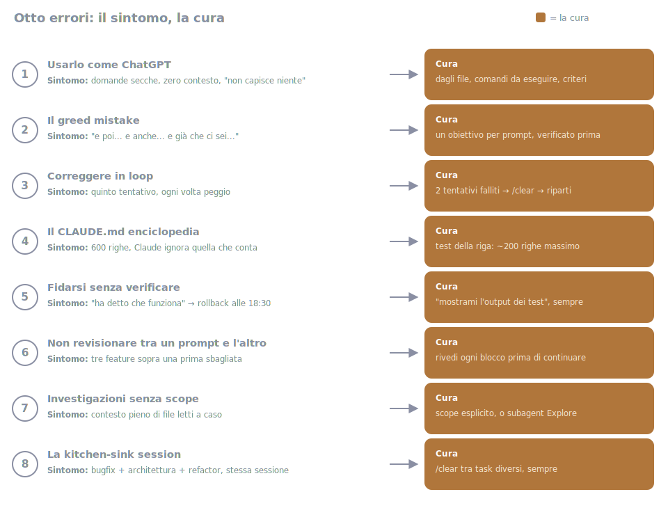

# 13 - Common Mistakes (and How to Catch Yourself Making Them)

> Source: the "avoid common failure patterns" section of the official best
> practices + the mistakes most reported by the community, July 2026.

Eight mistakes, all with the same structure: how it shows up (the symptom),
what's really going on (the mechanics), and the fix. The value of this
chapter isn't the list itself: it's learning to recognize the symptom *while
it's happening to you*, not three hours later.

## 1. Using it like ChatGPT

*Symptom*: terse questions, zero context, no files referenced, and then
"it doesn't understand anything".
*What's happening*: you're using 10% of the tool. Claude Code is an agent
with your repo in front of it: it can open files, run commands, verify
results. If all you do is ask questions, you have an expensive chat.
**Fix**: give it files (`@src/components/Modal.tsx`), commands to run
("run `npm test` and look at what fails"), success criteria. The value is
in the agentic loop (explore, edit, verify), not in the single answer.
Compare: "how do I center a div?" versus "the modal in
`@src/components/Modal.tsx` isn't centered on mobile: reproduce it, fix it,
and show me the screenshot". The second one is a Claude Code request.

## 2. The greed mistake

*Symptom*: a prompt that contains "and then… and also… and while you're
at it…".
*Result*: eight fronts open at 60%, none finished, context saturated,
and you can't even do a clean revert, because the eight things are
tangled together in the same files.
*What's happening*: every extra goal dilutes attention across all the
others, and none of them reaches the "done and verified" threshold.
**Fix**: one goal per prompt, verified before the next one (ch. 12).
The moment to catch it is **while you're writing the prompt**: at the first
"and while you're at it", cut it and put the rest in a note for later.

## 3. Correcting in a loop

*Symptom*: "no, not like that… no, I meant… still wrong…": you're on the
fifth attempt at the same spot and each one is worse than the last.
**Fix**: **the 2-attempt rule**. Two corrections gone wrong → `/clear` →
a fresh prompt that folds in what you learned from the failures ("note:
the approach using X doesn't work because Y"). The clean session gets on
the first try what the polluted one couldn't get on the fifth (the
mechanical reason is in ch. 03).

## 4. The encyclopedia CLAUDE.md

*Symptom*: 600 lines of instructions, and Claude ignoring precisely the
one that matters.
*What's happening*: instructions compete with each other for the model's
attention: every extra line dilutes all the others. A bloated file isn't
"more complete": it's a file where the rules that matter drown among the
ones that don't.
**Fix**: the line test ("has this line ever changed a behavior?")
and ~200 lines max (ch. 04).
*The signal*: when you catch yourself adding a line to CLAUDE.md for a
problem that happened exactly once. Wait for the second time.

## 5. Trusting without verifying

*Symptom*: "ok, it said it works" → merge → rollback at 6:30 pm.
*What's happening*: you accepted an assertion as if it were evidence. A
model declaring "it works" is expressing confidence in its own code,
the same misplaced confidence any author has in their own work.
**Fix**: never accept an assertion without evidence (ch. 11). "Show me
the test output" is the most profitable sentence in this guide: five
seconds to ask, and it turns a hope into a fact.

## 6. Not reviewing between prompts

*Symptom*: three features built on top of each other, then you discover the
first one was wrong, and the other two depend on it.
*What's happening*: a mistake doesn't cost what it costs when you make it.
It costs whatever you built on top of it. Every unverified block is a debt
that accrues interest with every subsequent prompt.
**Fix**: review (or have verified: tests, review, screenshots) every block
before building on it. Checkpoints (ch. 03) exist for exactly this:
go back while it's still free.

## 7. Unscoped investigations

*Symptom*: "take a look around the codebase and tell me what you think" →
half an hour later the context is full of randomly read files and the
session has gone dumb.
*What's happening*: every file read enters the context and stays there,
including the twenty irrelevant ones. Free-form exploration is the fastest
way to fill the context with noise, and noise degrades every subsequent
answer, including the ones about the actual task.
**Fix**: explicit scope ("only `src/auth/`, answer in 10 lines") or
delegate to an Explore subagent that explores in *its own* context and
brings back only the summary (ch. 06). A well-made prompt:

> "I need to understand how authentication works. Look only at `src/auth/`
> and `src/api/client.ts`. Answer in 10 lines: token flow, where it's
> stored, what happens on expiry. Don't read anything else."

## 8. The kitchen-sink session

*Symptom*: in the same session you've done the bugfix, three architecture
questions, a refactor and your grocery list. The answers get visibly
worse.
*What's happening*: the context fills up and performance degrades (the
mechanics, with the `/context` screenshot, are in ch. 03). It's the root
cause of half this list: the correction loop of point 3, the exploration
of point 7, all tributaries of the same river.
**Fix**: `/clear` between different tasks, always. It costs nothing: the
session stays recoverable with `/resume`. You're not "throwing away"
anything, just giving the new task a context that's only about it.
*The signal*: you notice you're about to ask a question unrelated to the
task at hand. That question deserves a session of its own.

---

**In short**: almost all the mistakes above are the same mistake seen
from different angles: treating the context as infinite and assertions as
proof. Clean context + verification at every step, and 80% of the problems
never happen in the first place. From here on, the Power section: skills,
agents, hooks and MCP (ch. 05-10). The tools pay off most precisely once
you stop making these mistakes.
