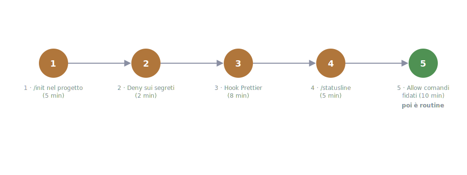

# 14 - Must-Haves and Costs: The First 30 Minutes of Setup

> Verified July 15, 2026. Prices change: check claude.com/pricing.

## The minimal setup that pays off right away

The problem this chapter solves: the guide has 17 chapters and you won't
apply them all on day one. Which five things should you do *right now*, in
the right order, so they pay off by the first afternoon? Here they are:

1. **`/init` in your project** → a starting CLAUDE.md, then prune it
   (ch. 04). Commit it: it's documentation for the team, not just for you.
   Without a CLAUDE.md every session starts from zero and you re-explain
   the same conventions every day.
2. **Deny rules for secrets** in `.claude/settings.json`: `Read(.env)`,
   `Read(.env.*)`, `Bash(cat *.env*)` (ch. 02). Two minutes, once and for
   all: the day Claude, exploring for a bug, is about to open the file
   with the API keys, the deny stops it without you having to be there.
3. **A Prettier hook** on PostToolUse (ch. 07). Every touched file comes
   out already formatted: no whitespace-only diff noise, no "reformat
   everything" at the end of the session. A frontend dev without this hook
   is leaving money on the table.
4. **`/statusline`**: put context usage and model in it, the two things
   you want to see *at all times*. A filling context explains half the
   weird behavior (ch. 13), and watching it climb in real time makes you
   run `/clear` at the right moment instead of three tasks too late.
5. **Allow rules for trusted commands**: `npm run test`, `npm run lint`,
   `git status/diff/log` on the allow-list, so you stop approving the
   obvious. Every confirmation prompt on a harmless command is friction
   that keeps you supervising instead of working.

And when the time comes, the sixth move adds itself: the Chrome extension
or Playwright MCP (ch. 10).

And then, the most important rule of all: **let the rest grow
just-in-time**. A skill the second time you re-explain a procedure, an
agent the first time a search pollutes your context, a hook the first time
Claude "forgets" a rule. Building the arsenal in advance is the surest way
to build the wrong one: real need is a better design criterion than any
prediction.

## The right model for the right task

The pain to avoid cuts both ways: paying for the big model to rename a
variable, or letting the small model wrestle with a subtle bug for an
hour. The map:

- The default (Sonnet) is fine for almost all day-to-day work.
- **`/model opusplan`** is the most-cited trick: the big model (Opus)
  plans, the mid-size one executes: you pay for reasoning where it pays
  off (the decisions) and save where it doesn't (the typing grunt work).
- The small model (Haiku) for mechanical work, especially in agents
  (`model: haiku` in the frontmatter, ch. 06): an agent that formats or
  greps for strings doesn't need to reason.
- `Alt+T` (extended thinking) for the genuinely hard problems, not by
  default: it's extra power at extra cost, and on the average task you
  won't notice it.

An honest note: the official docs sometimes push in the opposite direction
("use the big model with thinking: fewer corrections = faster overall").
Both positions are true in different cases: well-specified task →
mid-size model; ambiguous task that's expensive to correct → big model. The
dividing line is how likely the first attempt is to go wrong: if it's
likely, the big model that nails it right away costs *less* than three
rounds with the mid-size one.

*The signal*: if you notice you keep correcting the mid-size model on a
certain kind of task, that kind of task deserves the big one. If the big
one never does anything smart, you're paying for reasoning you don't use.

## The 5 money-saving habits (official)

1. `/clear` between tasks
2. a model sized to the task
3. reference files by path (`@src/…`) instead of pasting them
4. CLAUDE.md under ~200 lines
5. plan before large changes (fewer attempts = fewer tokens)

You'll notice these are the same rules as chapters 3, 4 and 13: **what
makes Claude work better is what costs less**. That's no coincidence: the
common enemy is wasted context. The token you pay for and the token that
confuses the model are the same token: optimizing for quality and
optimizing for cost, here, are the same move.

## Monitoring

Four tools, from most to least frequent:

- the statusline: everything below, always in view, without asking
- `/context`: how much context you're using (check it when answers get
  worse, that's usually where the explanation is)
- `/usage`: where you stand against your plan limits (Pro/Max)
- `/cost`: session spend (API users)

Orders of magnitude: the full table of plans is in ch. 01.

!!! note "The limit bites quickly"
    If Claude Code becomes your main tool, the Pro limit (~200 messages
    every 5 hours) bites quickly: it sounds like a lot until you spend a
    whole day in session.

## Going further (a glimpse)

Three directions for when the basic flow starts feeling tight:

- **`claude -p "prompt"`**: headless mode, Claude Code in scripts and in
  CI (`--output-format json` for structured output). The moment you need
  it: when something you do in a session should run on its own.
- **GitHub Actions**: `anthropics/claude-code-action`, `@claude` in PR
  comments for automated reviews and fixes; it respects the repo's
  CLAUDE.md, so the conventions you wrote apply there too.
- **Git worktrees**: multiple parallel sessions on different branches
  (`claude --worktree`); the bottleneck becomes your review capacity, not
  Claude. Try it only once your single-session flow is already solid:
  parallelizing chaos just gives you parallel chaos.

---

**In short**: five moves on day one (init, deny, format hook, statusline,
allow-list), the rest when you actually need it. And the habit that beats
them all: clean context, evidence always. If after these habits your
budget still pinches, [ch. 15](15-risparmiare-token.md) covers the tools
that compress tokens at the source, with measured numbers, not promised
ones.
