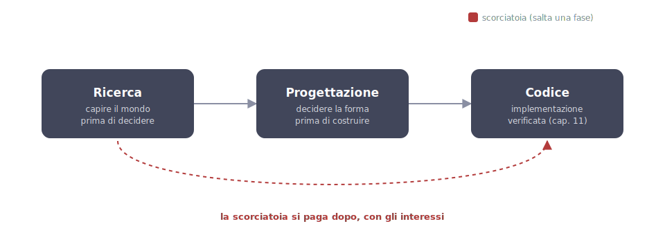

# 17 - Research and design before you build

> Verified July 16, 2026 against the official docs. Claude Design and
> Ultraplan are in research preview: behavior and availability may change.

**1 · Research first.** Understand the world before deciding: verified sources, not whatever idea came to mind. This is `/deep-research`, with cited sources.

**2 · Then design.** Decide the shape before building: plan mode, a SPEC, or Ultraplan depending on the stakes. This is where you correct ten lines of plan instead of a hundred lines of code.

**3 · Only then, code.** Implementation arrives with the check already defined, the executable criterion from ch. 11 written before you start.

**4 · The shortcut exists, and it gets paid for later.** Jumping from research straight to code, without deciding the shape, looks like it saves time: the dashed red arrow in the figure is that jump, and it comes back with interest.

**5 · Three stages, one tool each.** Research, design, code: each with its own tool and its own check. The shortcut is the only dimension coded in color, because it's the only one to avoid.

## The principle

Chapter 11 teaches you to verify work *after* it's done. This chapter
applies the same idea one step earlier: **the most expensive code is the
code built on top of a wrong decision**. A poorly chosen library, an
approach that doesn't hold up to the real use case, a misunderstood
requirement: none of it shows up in a test, because the code does exactly
what you asked for. The problem isn't the code. It's the request itself.
The fix is two activities that happen before implementation, each with its
own tool: **research** (understanding the world before deciding) and
**design** (deciding the shape before building).

## Deep research: research with evidence

**What it is.** `/deep-research` is a built-in skill (since June 2026)
that turns a question into a structured investigation. It's not "search
the web": it's a multi-agent harness that produces a report with cited
sources.

**How it works**: four phases.

1. **Clarification**: before it starts, it asks you two or three
   questions to narrow the scope, the same logic as the interview in
   ch. 12, applied to research.
2. **Fan-out**: a lead agent coordinates several workers that search in
   parallel, each from a different angle.
3. **Adversarial verification**: the claims it gathers get tested before
   they make it into the report. Same idea as ch. 11, applied to sources
   instead of code.
4. **Cited synthesis**: the final report links every claim to its
   source, so *you* can spot-check it instead of just trusting it.

**When to use it.** The signal is a hard-to-reverse decision made on
unfamiliar ground: which library to adopt, where to host a project,
whether a tool is mature and maintained, how a service actually behaves
on its free tier. This guide has a real example: the choice of where to
publish its site came out of exactly this kind of research, five options
checked against the official docs, with the real free-tier constraints
that marketing pages don't mention. The tools in ch. 15 went through the same
process before making it into the guide: checking the right repo,
confirming active maintenance, comparing claimed numbers against what we
actually measured.

**The cost, honestly.** A deep research run eats a real chunk of your
budget (it uses your plan's normal limits), so it's not worth spending on
a passing thirty-second doubt. A practical threshold: if getting the
decision wrong would cost you more than an hour of rework, the research
pays for itself.

## Design: from outline to reviewed plan

The guide has already given you two rungs for design; here we put them
on a ladder and add the third:

1. **Plan mode** (ch. 03), the everyday rung: Claude explores and
   proposes, you correct ten lines of plan instead of a hundred lines of
   code.
2. **Interview → SPEC** (ch. 12), for big features: Claude interviews
   you, the implicit requirements surface, and the written spec outlives
   the session. It's the pattern the official docs call "the fastest
   path to a good spec."
3. **Ultraplan** (`/ultraplan <request>`, research preview, Pro/Max
   plans), for when the plan deserves a document-style review instead
   of a terminal one: Claude writes it in the cloud and you review it
   **in the browser**, with inline comments on sections like a PR. Once
   the plan is approved, you choose: cloud execution (a PR shows up) or
   "teleport" the plan to your terminal to run it locally. Availability
   note: it doesn't work on enterprise cloud providers (Bedrock, Vertex,
   Foundry).

The ladder is the same one from ch. 11: you move up a rung as the cost
of a mistake goes up.

## Claude Design: designing the interface with your design system

**What it is.** [Claude Design](https://claude.ai/design) (research
preview, included in paid plans) is claude.ai's visual canvas: you
describe what you want and get designs, interactive prototypes, mockups,
then refine them by chatting, much like a Claude Code session but with a
canvas instead of a terminal.

**Why it matters for frontend work.** It can **import your design
system**, from a GitHub repo, from files, or straight from the codebase,
then check what it generates against your real components before showing
it to you. The mockup you get isn't "an idea to redo with the real
components": it's already built with the real components.

**The bridge to Claude Code** is the `/design-sync` skill. It works both
ways: it brings the repo's design system into Claude Design, and it sends
back to the canvas whatever you build in the terminal. The full flow for
a UI feature becomes:

1. you explore directions in Claude Design (canvas, fast visual
   iteration);
2. once you've picked a direction, the mockup already matches the design
   system;
3. you implement in Claude Code with the screenshot-driven cycle from
   ch. 10, using the mockup as the verification target.

**What about the Figma MCP** (ch. 10)? They complement each other rather
than compete: Claude Design for ideation and fast prototyping when the
design is born with you, the Figma MCP when the design already lives in
Figma or you need the code → Figma canvas round-trip for the design
team.

## In short

The full flow of a job done well has four stages, each with the right
tool and the right check: **research** (`/deep-research`, cited
sources) → **decision** → **plan** (plan mode → SPEC → Ultraplan, review
scaled to the stakes) → **implementation** (ch. 03 and 10, with the
"done" criterion from ch. 11).

| Tool | When | What it produces |
|---|---|---|
| `/deep-research` | a hard-to-reverse decision made on unfamiliar ground | a report with cited sources |
| Plan mode (ch. 03) | the everyday rung | ten lines of plan to correct, instead of a hundred lines of code |
| Interview → SPEC (ch. 12) | for big features | a written spec that outlives the session |
| `/ultraplan` | the plan deserves a document-style review instead of a terminal one | plan in the cloud, review in the browser with inline comments; then a cloud PR or local teleport |
| Claude Design | designing the interface, especially with a design system in the repo | designs, interactive prototypes, mockups already matching the real components |

!!! warning "The cost of skipping a stage"
    Every skipped stage comes back later, with interest.

Closing out the Method is the chapter on common mistakes
(ch. 13): the checklist of symptoms, before we move on to the tools.
