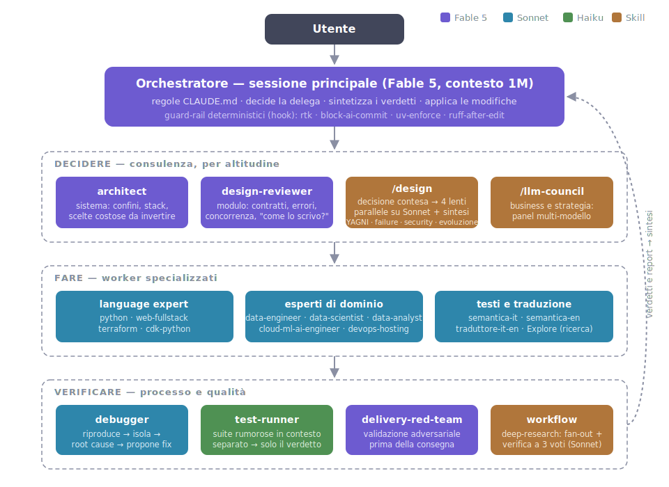

# 18 - The setup in plain sight: the files, line by line

> Ch. 16 covers the philosophy: three levels, what goes where. This
> chapter shows the **actual files** from my setup (July 2026), sanitized
> per the guide's policy: real structure and real rules, but the paths and
> names of client work projects are swapped for generic stand-ins (`acme`).
> It's not a template to copy wholesale: it's a working example to steal the
> pieces you need from.

## The map of the files

Before the blocks, the tree: the whole global setup lives in `~/.claude/`,
and every line below has its own section in this chapter.

```
~/.claude/
├── CLAUDE.md                 always-on rules (imports RTK.md)
├── settings.json             permissions, hooks, model, plugins
├── agents/                   17 .md files: the standing team
├── skills/                   12 folders: the procedures
├── commands/                 /commit, /standup
├── hooks/                    4 sh scripts: the guardrails
└── workflows/                deep-research.js: multi-agent orchestrations
```

The profiles (at the end of the chapter) mount this base via symlink and add
their own state on top; repos overlay their project-level `.claude/`. Three
levels, a single place where everything is defined.

## Permissions: allow, deny, ask

The `permissions` block in my global `~/.claude/settings.json` uses all
three lists, and each one does a different job:

```json
{
  "permissions": {
    "allow": [
      "Bash(rtk git status:*)",
      "Bash(rtk git diff:*)",
      "Bash(rtk git log:*)",
      "Bash(rtk git show:*)",
      "Bash(rtk git branch:*)",
      "Bash(rtk ls:*)",
      "Bash(rtk read:*)",
      "Bash(rtk grep:*)",
      "Bash(rtk rg:*)",
      "Bash(rtk wc:*)",
      "Bash(rtk git add:*)",
      "Bash(rtk git commit:*)",
      "Bash(rtk git push:*)",
      "WebSearch",
      "WebFetch(domain:github.com)",
      "WebFetch(domain:raw.githubusercontent.com)",
      "WebFetch(domain:www.npmjs.com)",
      "Bash(make check)",
      "mcp__atlassian__getJiraIssue",
      "mcp__atlassian__searchJiraIssuesUsingJql"
    ],
    "deny": [
      "Read(~/.config/acme/**)",
      "Read(**/.env)",
      "Read(**/.env.local)",
      "Read(**/credentials.json)",
      "Read(**/*.pem)",
      "Read(**/*.key)",
      "Read(~/.ssh/**)",
      "Read(~/.aws/credentials)",
      "Bash(*secrets.env*)",
      "Bash(*.config/acme*)",
      "Bash(*ACME_LLM_API_KEY*)",
      "Bash(*id_rsa*)",
      "Bash(*.ssh/*)"
    ],
    "ask": [
      "Bash(* .env*)",
      "Bash(*.pem*)",
      "Bash(*.key*)",
      "Bash(*credentials.json*)",
      "Bash(*~/.aws/*)"
    ]
  }
}
```

**Allow** holds only zero-risk operations I'd approve blindfolded a hundred
times a day: read-only git inspection (via rtk, ch. 15), reading files and
searching, the main repo's build gate, the documentation domains I consult
all the time, two read-only Jira tools. `git add`/`commit`/`push` look like
an exception to that principle, but they're covered elsewhere: the "never
commit without asking" rule lives in CLAUDE.md, and a hook (below) guards
the message content. Two limits I never cross: **never allowlist
interpreters** (`python`, `node`: that's arbitrary execution under another
name) and **never a generic `curl`** (it can POST, so it can exfiltrate
whatever it just read).

**Deny** protects secrets, and its history is a three-act lesson in syntax:

1. *Single-slash absolute paths don't work.* In file rules,
   `Read(/home/io/...)` is interpreted **relative to the settings file's
   directory**: my first deny-list blocked nothing at all. An absolute path
   is written `//path` (double slash) or, better, with `~/`.
2. *Don't enumerate commands, describe the sensitive string.* The first
   version had 32 rules (`cat`, `head`, `xxd`, `dd`, `strings`…) and still
   leaked: the list of ways to read a file is endless (`bash -c`, `perl`, a
   `<` redirect). Bash rules accept wildcards mid-pattern too, so
   `Bash(*secrets.env*)` denies **any** command that names that file, no
   matter which binary runs it. Three rules like that cover strictly more
   than the 32 before them.
3. *String matching is still gameable in principle* (indirect paths like
   `cat ~/.config/ac*/sec*`). The watertight version is the sandbox's
   `filesystem.denyRead`, which blocks reads at the kernel level for any
   child process. It's on my list of things to evaluate.

**Ask** is the most recent discovery: the missing middle ground. A pattern
as broad as "any command that touches a `.env`" in deny would cause real
damage: `cp .env.example .env` is a legitimate operation my fixtures do
routinely. With ask, the command pauses instead and asks: I deny suspicious
uses by hand, legitimate ones go through with a keystroke.

!!! tip "Deny or ask?"
    The criterion I distilled from this: **deny only where a false
    positive is nearly impossible; ask where the pattern is broad**.

There's no appeal with deny, and a rule that fights you ends up deleted,
which is worse than a rule that asks.

## Hooks: the rules that always hold

Four global hooks and one project hook, all born from the same criterion
(ch. 07 and 16): if an "almost never" violation is still one too many, the
rule deserves a hook.

**PreToolUse on Bash, first hook: rtk.** One line that transparently rewrites
commands into their compressed variant (ch. 15). No semantics involved, just
token savings on every project. Two recent hardenings, both from a design
review on hooks: the hook points to the binary by **absolute path** (it's
first in the chain, so rtk sees every command; resolving it via `$PATH` was
the vector behind the name collision documented in its own README), and it's
wrapped in `timeout 5`. If it hangs, the hook fails non-blocking and the
command goes through unrewritten: you lose the token savings on one call,
not the session.

**PreToolUse on Bash, second hook: the commit guardian.** The file is
`~/.claude/hooks/block-ai-commit.sh`, and I'm quoting it in full because
it's my favorite example of a small hook done well:

```sh
#!/bin/sh
# PreToolUse hook (Bash): block git commit messages that mention AI assistance.
# Exit 2 = block the tool call and show stderr to the model.
cmd=$(jq -r '.tool_input.command // empty')
case "$cmd" in
  *"git commit"*) ;;
  *) exit 0 ;; # (1)!
esac
# Narrow patterns on purpose — "anthropic" alone would block legitimate
# commits about Anthropic SDK code; widen only if something slips.
if printf '%s' "$cmd" | grep -qiE 'co-authored-by:[^"]*\b(claude|anthropic)|generated with|noreply@anthropic\.com|🤖'; then # (2)!
  echo "Commit bloccato: il messaggio viola le regole del CLAUDE.md. Riscrivilo." >&2
  exit 2 # (3)!
fi
exit 0
```

1. Exits immediately if the command isn't a commit: zero cost on 99% of
   cases.
2. The patterns are deliberately narrow (`anthropic` alone would block
   legitimate commits on code that uses the Anthropic SDK), because a
   guardian that cries wolf on false positives ends up disabled.
3. Exit code 2 blocks the tool **and** explains to the model why, so it
   corrects itself on the next try.

The choices that matter: it exits immediately if the command isn't a commit
(zero cost on 99% of cases); exit code 2 blocks the tool **and** explains to
the model why, so it corrects itself on the next try; the patterns are
deliberately narrow (`anthropic` alone would block legitimate commits on
code that uses the Anthropic SDK), because a guardian that cries wolf on
false positives ends up disabled. The prose in CLAUDE.md explains the
intent; the hook *guarantees* it.

**PreToolUse on Bash, third hook: the uv enforcer.** The "Python only through
uv" rule lived for months in CLAUDE.md as prose; `uv-enforce.sh` promoted it
to a guarantee, the same jump as the commit guardian. It blocks bare
`python`, `pip` and `pytest` in command position and suggests the equivalent
(`uv run`, `uv add`, `uv run pytest`); it lets through anything already
`uv`/`uvx` and commands where those words are just arguments (`git log
--grep pytest` is left alone). A note on method: before consolidating these
scripts into a single dispatcher, I ran the choice past a panel of four
lenses (the `/design` skill, more on it below). Unanimous verdict for
separate scripts: the settings' `hooks[]` array *is already* the dispatcher,
provided by the platform, with a property a merged script would lose: one
rule's bug can't take down the others.

**Global PostToolUse: ruff after every edit.** `ruff-after-edit.sh`: after
every edit to a `.py` file, `ruff check --fix` plus `ruff format`, then a
re-check; if errors remain it shows them to the model with exit 2, and the
model fixes them on the next try. Three details of a grown-up hook: a
failed *format* gets reported instead of vanishing silently (a write
interrupted halfway through must never slip by unnoticed); a `flock` on the
file serializes parallel subagents touching the same module; `uvx ruff`
still reads the project's config from its pyproject. It lives globally,
unlike the autoformat below, because the rule is mine and holds on every
Python repo I touch.

**Project-level PostToolUse: the autoformat.** In the main repo's
`.claude/settings.json`, on `Edit|Write`:

```json
{
  "hooks": {
    "PostToolUse": [{
      "matcher": "Edit|Write",
      "hooks": [{ "type": "command",
                  "command": "make format >/dev/null 2>&1 || true" }]
    }]
  }
}
```

It lives at the repo level because it's *that repo's* formatter making the
call; the `|| true` is essential: a convenience hook must never block your
work if it fails.

## Agents: the standing team

Seventeen global agents in `~/.claude/agents/`, all born from the
just-in-time rule in ch. 16 (a role comes up twice → it gets persisted). The
split that matters is **altitude of the decision**, and it also governs the
model assigned to each one:



- **Whoever judges inherits the session model**, the best one available:
  `architect` for the system (boundaries, stack, expensive-to-reverse
  choices), `design-reviewer` for the module (contracts, error strategy,
  concurrency: the question "how is it right to write this?") and
  `delivery-red-team`, the adversarial validator that combs the diff before
  every delivery. These are the roles whose judgment *is* the product: deep
  reasoning pays for itself there.
- **Whoever works sits on a mid-tier, pinned model**: the language experts
  (`python-expert`, `web-fullstack`, `terraform-expert`,
  `cdk-python-expert`), the domain experts (`data-engineer`,
  `data-scientist`, `data-analyst`, `cloud-ml-ai-engineer`,
  `devops-hosting`), `debugger` (reproduce → isolate → root cause), and the
  three prose agents (`semantica-it`/`semantica-en`, the only ones with
  Edit/Write, and `traduttore-it-en`, the `.en.md` twins of this guide).
- **Whoever executes mechanically sits on the small model**: `test-runner`
  runs the suite in an isolated context and reports only the verdict; the
  noise stays out of the session.

The pattern across the advisors stays the same: read-only tools (Read,
Grep, Glob, Bash), "advise and sketch a diff, don't apply bulk edits", and a
description that marks the boundary against related agents ("NOT for
Terraform → use terraform-expert"): that boundary is what lets the session
pick the right agent without guessing wrong.

!!! note "The three tiers"
    One question sums up the three-tier criterion: *does this role judge,
    work, or execute?*

The main session stays the orchestrator on the flagship model;
whoever judges sits beside it as a peer, whoever works and whoever executes
scale down a tier. And altitude closes a gap the language experts couldn't
close on their own: writing in a given language is the easy part by now,
*choosing how to write it* is the challenge. That band now has its own
roles: `design-reviewer` for the daily consult, the `/design` skill (below)
when the decision is contested.

At the repo level, project-specific ones get added. In the main repo: a
*gate-runner* that runs the build gate, and a read-only *guardian* that
reviews diffs against architectural invariants (ch. 16). Both are committed
under `.claude/agents/`, so they apply to anyone who clones the repo.

### How delegation kicks in (without me asking)

There's no hidden mechanism: automatic invocation is entirely written down
in two places the session always reads.

The first is the **agent description**. In every session Claude has the
list of available agents with their descriptions in front of it, and when
it weighs how to tackle a task it uses them as routing rules. That's why
mine aren't summaries but **routing rules**: they say when to use the
agent, list the typical cases, and, above all, mark the boundaries against
its neighbors ("NOT for Terraform → use terraform-expert"). A vague
description produces an agent that's never picked, or worse, picked
wrongly: it's the most important field in the file, and I rewrite it more
often than the prompt.

The second is the **global CLAUDE.md**, which turns the principle into a
reflex. The rule "delegate to agents by default" carried little weight on
its own; what works is the map of cases next to it: *non-trivial bug →
debugger before touching code; noisy suites → test-runner; stack choices →
architect before implementing; module design → design-reviewer before
implementing; contested design decision → /design; broad exploration →
Explore; text to humanize → semantica-it/semantica-en.* When the case comes
up, the session doesn't decide *whether* to delegate: it recognizes the row
in the map and delegates (ch. 16: examples beat precepts).

And then there's the third way, the simplest one: I ask by name ("run the
debugger on this"). It always applies, and it wins over the other two.

### How I orchestrate them

Three patterns cover almost all of my usage:

- **In parallel when the jobs are independent.** Multiple agents launched
  in the same message run concurrently: the Python review and the IaC
  review of the same diff don't wait on each other. It's the cheapest way
  to buy time.
- **In a pipeline when one's output is another's input.** The textbook case
  is this guide: every new chapter goes through semantica-it (Italian
  review) → traduttore-it-en (the `.en.md` twin) → semantica-en (English
  polish). I write, the chain refines, and I never re-run it by hand: it's
  encoded in a skill (below).
- **In the background when the result isn't needed right away.** A long
  analysis starts, I keep working, the notification arrives when it's done.
  An agent I've already launched can also be resumed with a follow-up
  message rather than restarted from scratch: its context survives the
  response.

The common thread: the main session stays the director, agents report back
*conclusions* (a verdict, a proposed diff, a diagnosis), never the noise of
the path. That's why my advisors don't edit: if the agent applied changes
on its own, orchestration would turn into surveillance.

## Skills and slash commands: the procedures

Twelve global skills in `~/.claude/skills/`, grouped by job:

- **Prose and bilingualism**: `humanize` (orchestrates the semantica-*
  reviewers), `sync-en` (finds Italian chapters changed via git and gets
  the English twins retranslated: it's the skill that keeps this guide
  bilingual).
- **Screenshots**: `screenshot` (the user shows me something),
  `screenshot-autonomo` (I look at the screen on my own),
  `screenshot-recenti` (reuses shots already taken). Three separate skills
  because the *trigger* is different: lumping them together confused the
  choice.
- **Browser**: `playwright-browser`, the generic core other domain-specific
  skills (demos, visual documentation) build on.
- **Knowledge**: `graphify` (ch. 16).
- **Decisions**: `llm-council` (five advisors on different models for
  business decisions with real stakes) and its engineering twin `design`: a
  contested design decision goes through four parallel lenses
  (simplicity/YAGNI, robustness, security at the boundaries,
  evolution/operability), each forced to judge from its own angle alone,
  with the synthesis deciding conflicts instead of splitting the
  difference. The lenses are prompts inside the skill, not standing agents:
  the taxonomy stays lean and a new lens costs one paragraph.
- **Hygiene**: `clean-conversations` and `purge-project` (per-project
  history cleanup), `new-agent` (the scaffolding for the just-in-time rule:
  when a role recurs, this skill persists it).

Plus two slash commands in `~/.claude/commands/`: `/commit` (stage, logical
commits, branch and push per my conventions) and `/standup` (the "where was
I" on the current repo). The practical difference from skills: commands are
procedures *I* invoke, skills are procedures the session can also choose to
use on its own when it recognizes the case.

### How they get used (the two entry points)

The mechanism is the same as for agents: in every session Claude sees the
list of skills with their descriptions, and the descriptions act as the
trigger. Mine contain **explicit trigger phrases** ("TRIGGER: 'umanizza',
'sa di AI', 'de-bot questo testo'") and **non-cases** ("NOT for source
code; NOT for a desktop screenshot → use screenshot"): when my prompt
matches the case, the session loads the skill on its own. The second entry
point is me typing `/name`, which forces invocation without interpretation.
Same lesson as the agent descriptions: they don't describe, they *route*.

The most useful thing I learned writing them: **a skill is a written
orchestrator**. `humanize` doesn't review text: it routes files to the
`semantica-it`/`semantica-en` reviewers in parallel and reports back a
sample of the rewrites. `sync-en` doesn't translate: it finds Italian
chapters changed via git, sends the twins to `traduttore-it-en`, runs
`semantica-en` over the new material, and regenerates the site. This
guide's translation pipeline, in other words, isn't a habit of mine: it's a
file. If an orchestration works well by hand twice, the third time write it
into a skill: it's the just-in-time rule applied to processes instead of
roles.

## Profiles: the anatomy of isolation

Ch. 16 describes profiles as the "client" level; in my actual setup the
split is by **activity**, not by client: `delivery` (delivery work),
`personale` (my own projects, this guide included), and `scouting`
(exploring tools and technologies). Same mechanism, different cut: the
right boundary is the one that separates *mental contexts*, and for me two
activities on the same code are more different than two clients on the
same activity.

Inside each profile, the structure says exactly what's shared and what's
isolated, and it's all done with symlinks into `~/.claude/`:

```
~/.cloak/profiles/delivery/
├── CLAUDE.md      -> ~/.claude/CLAUDE.md      (shared)
├── settings.json  -> ~/.claude/settings.json  (shared: permissions and hooks)
├── agents         -> ~/.claude/agents          (shared)
├── commands       -> ~/.claude/commands        (shared)
├── skills         -> ~/.claude/skills          (shared)
├── plugins        -> ~/.claude/plugins         (shared)
├── .credentials.json        (ITS OWN: login and tokens)
├── .claude.json             (ITS OWN: MCP and project state)
├── projects/<repo>/memory/  (ITS OWN: persistent memory)
└── sessions/, history, plans/, jobs/ (ITS OWN)
```

The most important line is `settings.json`: even the **permissions and
hooks are shared**. The secrets deny-list and the commit guardian apply
identically in every profile, because they're rules about who I am, not
about what I'm doing. What stays per-profile is the *state* instead:
credentials (each profile has its own login), the MCP servers with their
authentication, and, above all, **per-project memory**. That last one is
the most concrete benefit: the same repo has different memories in
`delivery` and in `scouting`, because the lessons of delivering aren't the
lessons of exploring.

## MCP: few, and at the right level

The list of MCP servers is deliberately short, and *where* matters as much
as *what*:

- **In every profile**: `tolaria` (the server for my notes app) and
  `atlassian` (Jira). The servers are registered everywhere, but **authentication** is
  per-profile: each profile has its own credentials, and a profile without
  login to a given Jira can't write to it by construction, not by
  discipline (ch. 16).
- **Per directory**: `playwright` exists only in this guide's demo
  directory, in the profile where I work on it: it drives the browser for
  chapter screenshots, and no other session has any reason to have it in
  context. It's the "lowest level" criterion taken to the extreme.

The criterion is the same as the three levels: an MCP belongs **at the
lowest level where it's needed**. Every extra server adds context and
attack surface, so a well-reasoned no (ch. 16, the web-search server I
passed on) is as much a part of the setup as the yeses.

## Workflows: the orchestration written all the way through

Skills orchestrate agents; **workflows** orchestrate whole multi-agent
harnesses with deterministic flow control (fan-out, voted checks,
synthesis). I keep exactly one, but customized:
`~/.claude/workflows/deep-research.js`, my copy of the research workflow
(fan-out of web searches, adversarial 3-vote verification per claim, a
cited report) with one modification worth mentioning: **the model is
assigned per phase**. The mechanical, wide phases (fetching sources,
verifying claims: dozens of agents) run on the mid-tier model; question
decomposition and the final synthesis (few agents, all judgment) inherit the
session's model. It's the agent-tier rule applied inside a single workflow,
and I learned it the hard way: the first run threw everything at the
flagship model, and it wasn't needed.

## Everything else: plugins, statusline, model

A few lines round out the picture. Two plugins: `ponytail` (an output style
that enforces the laziest solution that works, YAGNI as a permanent mode)
and `langfuse` from the official marketplace (tracing and evals for the LLM
systems I work on); I've also registered Anthropic's community marketplace:
third-party plugins with automatic screening, browsable with `/plugin`.
There's also a custom statusline (`statusline.sh`: branch, model and
remaining context at a glance), plus the model pinned in settings with the
extended context window. Everything else is default: every setting you
don't write is a setting you don't have to maintain.

## In short

The most important file in this chapter isn't any of the JSON blocks: it's
the criterion behind each one. Allow is measured against real transcripts,
not imagined ones. Deny targets sensitive strings, not lists of commands.
Ask covers the gray zone in between, and rules with no exceptions become
hooks. Agents are born when a role recurs, never before; each one's model
follows the question "does it judge, work, or execute?"; agent and skill
descriptions route rather than describe; orchestrations you repeat by hand
become skills. Profiles handle isolation between contexts, and whatever
applies everywhere travels via symlink, while MCP servers sit at the
lowest level that justifies them. If your setup applies these criteria,
it'll look like mine only where our jobs overlap, and that's exactly the
point.
